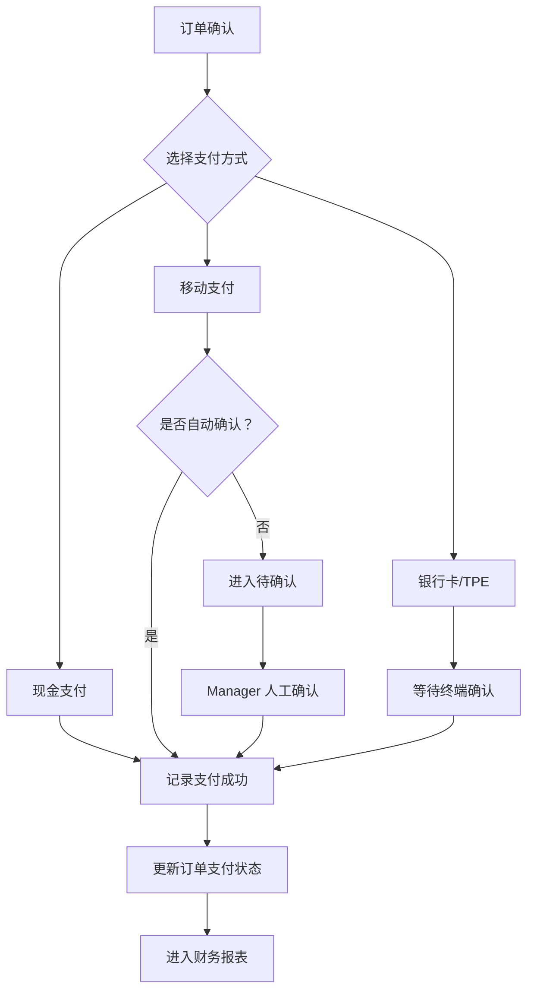
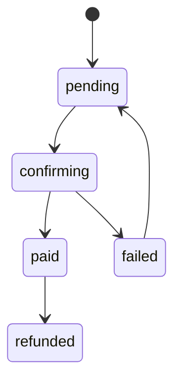
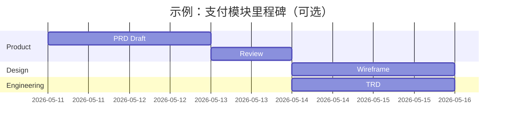

# 公司通用 PRD 文档模板

> 文档类型：Product Requirements Document  
> 适用范围：新产品、功能模块、平台能力、业务流程、内部工具、移动端/Web 端/后台系统等。  
> 模板原则：**按项目复杂度裁剪，不要求所有章节都必填。**  
> 示例说明：本文档中的“支付模块”“张三”“流程图”等均为示例内容，用于演示写法，实际使用时应替换。

---

## 0. 模板使用说明

### 0.1 章节级别说明

| 标记 | 含义 | 使用规则 |
| ---- | ---- | -------- |
| **必填** | 所有 PRD 都应包含 | 小项目也不能省略 |
| **条件必填** | 满足特定条件时必须包含 | 如涉及权限、支付、硬件、跨端、合规等 |
| **可选** | 根据项目需要选择 | 不应为了形式强行填写 |

### 0.2 项目规模裁剪建议

| 项目类型 | 建议章节 |
| -------- | -------- |
| **小型功能** | 文档概述、背景目标、范围、功能需求、验收标准、风险 |
| **中型模块** | 增加用户角色、业务流程、非功能需求、数据概览、埋点指标 |
| **大型/高风险项目** | 增加阶段计划、权限矩阵、依赖系统、合规、安全、灰度、上线和回滚 |

### 0.3 图表使用原则

图表不是为了显得专业，而是为了降低沟通成本。

| 图表 | 是否必填 | 适用场景 |
| ---- | -------- | -------- |
| 流程图 | 条件必填 | 用户路径、业务流程、审批流、状态流转复杂时 |
| 状态机图 | 条件必填 | 订单、支付、工单、库存、同步等状态复杂时 |
| 页面流转图 | 条件必填 | 多页面、多入口、多角色操作时 |
| 甘特图 | 可选 | 不建议放在 PRD 主体，通常属于项目计划文档 |
| 表格 | 常用 | 范围、角色、规则、验收标准、风险 |

---

## 1. 文档基本信息（必填）

### 1.1 命名规范

推荐格式：

```text
{项目名}-{模块名或阶段名}-PRD-v{主版本}.{次版本}.md
```

示例：

```text
AlphaPay-支付模块-PRD-v0.1.md
RetailOS-库存管理-PRD-v1.0.md
Clean_Hub-Phase_1范围与验收标准-v0.1.md
```

### 1.2 存放目录规范

推荐目录：

```text
docs/01-product/prd/             产品总 PRD
docs/01-product/phase-scope/     阶段范围与验收标准
docs/01-product/user-flows/      用户流程、页面清单
docs/01-product/permissions/     权限矩阵
docs/01-product/special-topics/  专题需求
docs/01-product/backlog/         Epic / Feature / User Story 初稿
```

### 1.3 版本记录

| 版本 | 日期 | 修改人 | 审阅人 | 状态 | 说明 |
| ---- | ---- | ------ | ------ | ---- | ---- |
| v0.1 | 2026-05-11 | 张三 | 李四 | Draft | 初稿，定义支付模块业务范围 |
| v0.2 | 2026-05-12 | 张三 | 王五 | Review | 补充退款和异常支付场景 |
| v1.0 | 2026-05-15 | 张三 | 产品负责人 | Approved | 评审通过，进入研发设计 |

状态建议：

- `Draft`：草稿。
- `Review`：评审中。
- `Approved`：已确认，可进入设计/研发。
- `Deprecated`：已废弃。

### 1.4 文档目的

示例：

本文档用于定义 **支付模块** 的产品需求，明确业务背景、目标、用户角色、功能范围、业务规则、验收标准和待确认事项。

### 1.5 阅读对象

按实际项目选择：

- 业务方
- 产品经理
- 项目经理
- UI/UX
- 研发负责人
- 前端工程师
- 后端工程师
- 测试工程师
- 数据分析师
- 运维/支持团队

### 1.6 关联文档

| 文档 | 路径 | 说明 |
| ---- | ---- | ---- |
| 产品总 PRD | `docs/01-product/prd/xxx.md` | 产品总体范围 |
| 阶段范围文档 | `docs/01-product/phase-scope/xxx.md` | 阶段交付范围 |
| TRD | `docs/04-technical/trd/xxx.md` | 技术设计 |
| 测试用例 | `docs/05-qa/test-cases/xxx.md` | 验收与测试 |

---

## 2. 背景与目标（必填）

### 2.1 业务背景

说明当前业务现状、问题来源、用户痛点、市场/运营/管理诉求。

示例：

当前门店支付依赖人工记录，容易出现漏记、错记、重复入账和对账困难。门店需要一套可追溯、可对账、可审计的支付记录能力。

### 2.2 问题定义

| 问题 | 影响 | 当前处理方式 |
| ---- | ---- | ------------ |
| 支付方式记录不统一 | 财务对账困难 | 人工登记 |
| 移动支付状态不清晰 | 容易重复确认 | 收银员口头确认 |
| 退款无审批记录 | 追责困难 | 线下沟通 |

### 2.3 产品目标

- 支持订单收款。
- 支持多种支付方式记录。
- 支持支付状态追踪。
- 支持待确认支付人工确认。
- 支持支付记录进入财务报表。

### 2.4 成功指标

| 指标 | 目标 |
| ---- | ---- |
| 支付记录完整率 | 100% 支付动作有记录 |
| 重复入账 | 0 起 |
| 支付查询耗时 | 1 秒内返回常用查询 |
| 财务对账差异 | 关键金额差异为 0 |

---

## 3. 用户与场景（必填）

### 3.1 用户角色

| 角色 | 目标 | 关键诉求 |
| ---- | ---- | -------- |
| Cashier | 完成收款 | 操作快、状态清楚、能打印小票 |
| Manager | 管理异常支付 | 能确认、修正、查看记录 |
| Owner | 查看经营结果 | 支付汇总准确，能对账 |
| Support | 排查问题 | 能追踪支付状态和操作日志 |

### 3.2 核心使用场景

| 场景 | 描述 | 优先级 |
| ---- | ---- | ------ |
| 现金支付 | 客户到店后使用现金支付订单 | P0 |
| 移动支付待确认 | 客户使用移动支付，门店等待确认 | P0 |
| 支付修正 | Manager 修正错误支付记录 | P1 |

---

## 4. 范围定义（必填）

### 4.1 In Scope

- 现金支付。
- 移动支付记录。
- 支付状态管理。
- 待确认支付人工确认。
- 支付记录查询。
- 支付进入财务报表。

### 4.2 Out of Scope

- 自动银行卡清算。
- 跨境支付。
- 复杂分账。
- 自动税务申报。

### 4.3 Pending Confirmation

- 支付服务商 API。
- 支付 webhook 可靠性。
- 退款审批流程。
- 移动支付失败后的人工处理规则。

---

## 5. 功能需求（必填）

### 5.1 功能清单

| 功能 | 描述 | 优先级 |
| ---- | ---- | ------ |
| 创建支付记录 | 订单确认后创建支付记录 | P0 |
| 支付状态管理 | 管理待支付、待确认、已支付、失败 | P0 |
| 支付修正 | 授权用户可修正支付记录 | P1 |

### 5.2 详细需求示例

#### 5.2.1 创建支付记录

用户在订单确认后选择支付方式并提交金额。系统生成支付记录，记录订单、金额、支付方式、操作人、门店和时间。

业务规则：

- 支付金额不能小于 0。
- 支付金额不能超过订单待支付金额，除非业务明确支持预收或溢收。
- 支付记录创建后不可物理删除。

#### 5.2.2 支付状态管理

支付状态建议：

- `pending`：待支付。
- `confirming`：待确认。
- `paid`：已支付。
- `failed`：支付失败。
- `refunded`：已退款。

---

## 6. 业务流程（条件必填）

当存在多步骤、多角色、多分支或复杂状态时，应补充流程图。

### 6.1 流程图示例



### 6.2 状态机示例

如果模块存在复杂状态，建议补充状态机。



---

## 7. 页面与交互要求（条件必填）

适用于有 UI 的项目。

| 页面 | 入口 | 核心操作 | 备注 |
| ---- | ---- | -------- | ---- |
| 支付确认页 | 订单详情 | 选择支付方式、确认收款 | P0 |
| 支付记录页 | 财务菜单 | 查询支付状态 | P1 |
| 支付修正弹窗 | 支付记录 | 修改支付状态或金额 | 需权限 |

---

## 8. 数据与埋点需求（条件必填）

### 8.1 数据对象概览

| 对象 | 说明 |
| ---- | ---- |
| Payment | 支付记录 |
| Payment Event | 支付状态变更事件 |
| Audit Log | 审计日志 |

### 8.2 埋点示例

| 事件 | 触发时机 | 关键属性 |
| ---- | -------- | -------- |
| `payment_created` | 创建支付记录 | 支付方式、金额、订单 ID |
| `payment_confirmed` | 支付确认 | 操作人、确认方式 |
| `payment_failed` | 支付失败 | 错误原因 |

---

## 9. 非功能需求（条件必填）

适用于涉及性能、安全、合规、可用性、数据可靠性的项目。

- 支付操作必须具备幂等能力。
- 支付记录不可物理删除。
- 支付修正必须审计。
- 支付查询必须按租户和门店隔离。
- 支付失败必须展示可理解的错误信息。

---

## 10. 验收标准（必填）

| 场景 | 验收标准 | 优先级 |
| ---- | -------- | ------ |
| 现金支付 | 支付成功后订单状态更新，小票可打印，进入财务报表 | P0 |
| 待确认支付 | 支付记录显示待确认，Manager 可人工确认 | P0 |
| 支付修正 | Cashier 无权修正，Manager 修正后记录审计日志 | P1 |
| 重复提交 | 不产生重复支付记录 | P0 |

---

## 11. 风险与待确认（必填）

| 风险 | 影响 | 建议 |
| ---- | ---- | ---- |
| 支付服务商 API 未确认 | 影响自动确认和 webhook | 先实现人工确认式支付记录 |
| 网络不稳定 | 影响支付状态及时更新 | 增加待确认状态和人工复核 |
| 重复回调 | 可能重复入账 | 使用幂等键 |

---

## 12. 项目计划引用（可选）

PRD 通常不直接维护排期。若需要展示里程碑，可引用项目计划文档，或放一个简化示意。

> **建议：甘特图默认放在项目计划文档，不作为 PRD 必填内容。**



---

## 13. 附录（可选）

### 13.1 术语

| 术语 | 说明 |
| ---- | ---- |
| Payment | 支付记录 |
| Z Report | 日结/班结报表 |
| Idempotency Key | 幂等键 |

### 13.2 Open Questions

| 问题 | 负责人 | 截止时间 | 状态 |
| ---- | ------ | -------- | ---- |
| 支付服务商是否提供测试环境？ | 张三 | 2026-05-15 | Open |

