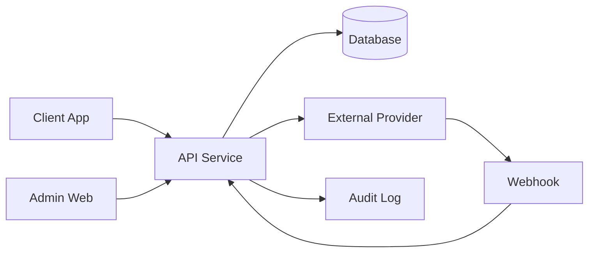
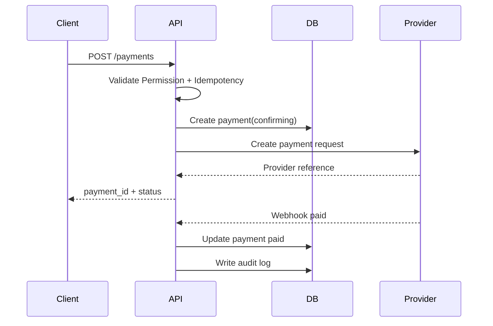
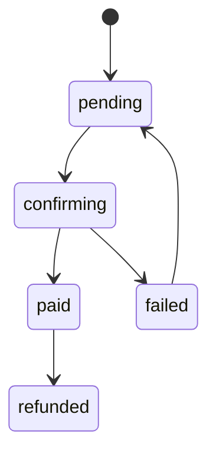
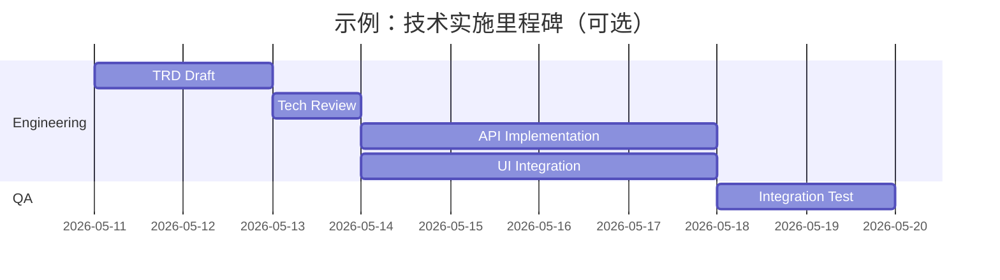

# 公司通用 TRD 文档模板

> 文档类型：Technical Requirements / Technical Design Document  
> 适用范围：技术方案、模块设计、系统架构、平台能力、专题技术设计。  
> 模板原则：**按系统复杂度裁剪，不要求所有章节都必填。**  
> 示例说明：本文档中的“支付模块”“张三”“架构图”等均为示例内容，用于演示写法，实际使用时应替换。

---

## 0. 模板使用说明

### 0.1 章节级别说明

| 标记 | 含义 | 使用规则 |
| ---- | ---- | -------- |
| **必填** | 所有 TRD 都应包含 | 小项目也不能省略 |
| **条件必填** | 满足特定条件时必须包含 | 如涉及数据库、API、权限、异步、第三方、支付、硬件等 |
| **可选** | 根据项目需要选择 | 不应为了形式强行填写 |

### 0.2 项目规模裁剪建议

| 项目类型 | 建议章节 |
| -------- | -------- |
| **小型功能** | 文档概述、范围、方案说明、API/数据变更、测试和发布 |
| **中型模块** | 增加架构图、数据模型、权限、安全、可观测性、风险 |
| **大型/高风险系统** | 增加扩展性、性能、容量、容灾、灰度、回滚、ADR、运维 Runbook |

### 0.3 图表使用原则

| 图表 | 是否必填 | 适用场景 |
| ---- | -------- | -------- |
| 架构图 / 上下文图 | 条件必填 | 多服务、多端、多依赖系统 |
| 时序图 | 条件必填 | 多系统交互、异步流程、第三方回调 |
| 状态机图 | 条件必填 | 订单、支付、工单、同步、审批等状态复杂 |
| ER 图 | 条件必填 | 数据模型复杂或关系较多 |
| 甘特图 | 可选 | 通常属于项目计划；仅当 TRD 同时承载实施计划时使用 |

---

## 1. 文档基本信息（必填）

### 1.1 命名规范

推荐格式：

```text
{项目名}-{阶段/模块}-TRD-v{主版本}.{次版本}.md
```

示例：

```text
AlphaPay-支付模块-TRD-v0.1.md
RetailOS-库存同步-TRD-v1.0.md
Clean_Hub-Phase_1-Web_Admin基础模块-TRD-v0.1.md
```

### 1.2 存放目录规范

```text
docs/04-technical/trd/           技术方案总览或模块 TRD
docs/04-technical/architecture/  架构图、ADR、模块边界
docs/04-technical/api/           API 设计
docs/04-technical/database/      数据库设计、ERD、迁移
docs/04-technical/offline/       离线同步技术方案
docs/04-technical/payments/      支付与财务技术方案
docs/04-technical/hardware/      硬件集成技术方案
docs/04-technical/deployment/    部署、环境、CI/CD、运维
```

### 1.3 版本记录

| 版本 | 日期 | 修改人 | 审阅人 | 状态 | 说明 |
| ---- | ---- | ------ | ------ | ---- | ---- |
| v0.1 | 2026-05-11 | 张三 | 李四 | Draft | 支付模块技术方案初稿 |
| v0.2 | 2026-05-12 | 张三 | 王五 | Review | 补充幂等和 webhook 设计 |
| v1.0 | 2026-05-15 | 张三 | 技术负责人 | Approved | 技术评审通过 |

状态建议：

- `Draft`：草稿。
- `Review`：技术评审中。
- `Approved`：已批准，可进入开发。
- `Deprecated`：已废弃。

### 1.4 关联文档

| 文档 | 路径 | 说明 |
| ---- | ---- | ---- |
| PRD | `docs/01-product/xxx.md` | 产品需求 |
| API 文档 | `docs/04-technical/api/xxx.md` | 接口设计 |
| 数据库设计 | `docs/04-technical/database/xxx.md` | 数据模型 |
| 测试计划 | `docs/05-qa/test-plans/xxx.md` | 测试策略 |

---

## 2. 背景与目标（必填）

### 2.1 背景

说明该技术方案要解决的业务或技术问题。

示例：

支付模块需要支持现金、移动支付、待确认状态、财务入账和后续第三方回调。系统需要避免重复入账，并确保支付记录可审计。

### 2.2 技术目标

- 定义模块边界。
- 定义核心数据模型。
- 定义 API 和错误码。
- 定义权限、安全、审计和幂等规则。
- 定义测试、发布和回滚策略。

### 2.3 非目标

- 不设计跨境支付。
- 不设计复杂分账。
- 不设计完整税务发票系统。

---

## 3. 范围与约束（必填）

### 3.1 In Scope

- 支付创建。
- 支付状态管理。
- 支付幂等。
- 支付审计。
- 支付查询。

### 3.2 Out of Scope

- 自动银行卡清算。
- 第三方平台分账。
- 复杂税务申报。

### 3.3 技术约束

- 所有支付记录必须包含 `tenant_id`。
- 门店交易必须包含 `branch_id`。
- 支付请求必须具备幂等键。
- 支付记录不允许物理删除。

---

## 4. 方案总览（必填）

### 4.1 方案摘要

简述最终选择的方案，包括核心模块、数据流、依赖系统、关键取舍。

示例：

支付模块由客户端发起支付请求，API 服务负责权限校验、幂等校验、支付记录创建和状态更新。第三方支付回调通过 webhook 进入 API，由 API 校验签名后更新支付状态并写入审计日志。

### 4.2 备选方案与取舍（条件必填）

| 方案 | 优点 | 缺点 | 结论 |
| ---- | ---- | ---- | ---- |
| 客户端直连支付服务商 | 实现快 | 安全风险高，密钥暴露 | 不采用 |
| API 统一代理支付 | 安全、可审计、可幂等 | 后端复杂度增加 | 采用 |

---

## 5. 架构设计（条件必填）

适用于多端、多服务、多第三方依赖的项目。

### 5.1 上下文图示例



### 5.2 模块边界

| 模块 | 职责 |
| ---- | ---- |
| Client | 发起请求、展示状态 |
| API | 权限校验、业务规则、幂等、审计 |
| Database | 持久化业务数据 |
| External Provider | 第三方服务处理 |
| Audit | 记录关键操作 |

---

## 6. 数据设计（条件必填）

适用于新增或修改数据模型的项目。

### 6.1 核心实体

| 实体 | 说明 |
| ---- | ---- |
| `payments` | 支付主表 |
| `payment_events` | 支付事件表 |
| `audit_logs` | 审计日志 |

### 6.2 字段示例

| 字段 | 类型 | 说明 |
| ---- | ---- | ---- |
| `id` | ULID / varchar(26) | 主键 |
| `tenant_id` | ULID / varchar(26) | 租户 ID |
| `branch_id` | ULID / varchar(26) | 门店 ID |
| `status` | enum | 状态 |
| `created_at` | timestamp | 创建时间 |

### 6.3 迁移与兼容

- 是否需要数据库 migration。
- 是否需要 backfill。
- 是否兼容旧版本 API。
- 是否支持灰度期间双写或双读。
- 是否遵守 CleanHub ID 规范：业务主键使用 ULID，禁止自增 ID 和 PostgreSQL `uuid` 主键。

---

## 7. API 设计（条件必填）

适用于对外或前后端交互接口。

| 方法 | 路径 | 说明 | 权限 |
| ---- | ---- | ---- | ---- |
| `POST` | `/payments` | 创建支付 | `payment:create` |
| `GET` | `/payments/:id` | 查询支付 | `payment:read` |
| `POST` | `/payments/:id/confirm` | 人工确认支付 | `payment:confirm` |

### 7.1 请求示例

```json
{
  "order_id": "ord_001",
  "amount": 12000,
  "method": "wave",
  "idempotency_key": "device-001-op-0001"
}
```

### 7.2 响应示例

```json
{
  "payment_id": "pay_001",
  "status": "confirming"
}
```

### 7.3 错误码

| 错误码 | 含义 | 处理方式 |
| ------ | ---- | -------- |
| `400` | 请求参数错误 | 前端展示字段错误 |
| `401` | 未登录 | 跳转登录 |
| `403` | 无权限 | 展示无权限 |
| `409` | 幂等冲突或状态冲突 | 展示冲突原因 |
| `500` | 服务异常 | 提示稍后重试并记录日志 |

---

## 8. 核心流程（条件必填）

### 8.1 时序图示例



### 8.2 状态机示例



---

## 9. 权限、安全与合规（条件必填）

适用于涉及账号、租户、资金、隐私、后台管理或敏感操作的项目。

- API 必须校验权限。
- 不允许跨租户访问数据。
- 敏感操作必须记录审计日志。
- 第三方 webhook 必须校验签名。
- 敏感字段需要脱敏或加密。

---

## 10. 可观测性与运维（条件必填）

- 关键请求日志。
- 关键状态变更日志。
- 错误日志。
- 指标打点。
- 告警策略。
- 排障入口。

示例：

| 指标 | 说明 | 告警建议 |
| ---- | ---- | -------- |
| `payment_create_error_rate` | 创建支付失败率 | 5 分钟超过阈值告警 |
| `webhook_failure_count` | 回调失败次数 | 连续失败告警 |

---

## 11. 性能与容量（条件必填）

适用于高并发、大数据量、强实时或核心链路。

| 指标 | 目标 |
| ---- | ---- |
| P95 响应时间 | 例如小于 300ms |
| 峰值 QPS | 例如 500 QPS |
| 数据增长 | 例如每天 100 万条 |
| 可用性 | 例如 99.9% |

---

## 12. 测试策略（必填）

| 类型 | 内容 |
| ---- | ---- |
| 单元测试 | 状态机、金额校验、权限判断 |
| 集成测试 | API、数据库、第三方回调 |
| 权限测试 | 不同角色、租户隔离、越权访问 |
| 回归测试 | 核心业务链路 |
| 异常测试 | 重复提交、网络失败、回调失败 |

---

## 13. 发布与回滚（必填）

### 13.1 发布步骤

1. 数据库 migration。
2. 后端发布。
3. 前端发布。
4. 配置第三方依赖。
5. 冒烟测试。
6. 灰度或全量发布。

### 13.2 回滚策略

- 应用版本可回滚。
- 数据库变更需兼容旧版本或提供回滚方案。
- 第三方配置需可切换或降级。
- 高风险能力需支持 feature flag。

---

## 14. 实施计划引用（可选）

TRD 通常不直接维护项目排期。若技术方案需要表达技术实施顺序，可放简化计划；正式甘特图应以项目经理的计划文档为准。



---

## 15. 风险与待确认（必填）

| 风险 | 影响 | 方案 |
| ---- | ---- | ---- |
| 服务商 API 不稳定 | 状态延迟或失败 | 降级为人工确认 |
| 重复回调 | 重复入账 | 幂等键 + 唯一约束 |
| webhook 签名规则未确认 | 安全风险 | 上线前阻塞确认 |

---

## 16. 技术评审清单（必填）

- [ ] 范围和非目标清晰。
- [ ] 方案边界清晰。
- [ ] 数据模型和迁移方案清晰。
- [ ] API 权限和错误码清晰。
- [ ] 幂等、重试和重复提交处理清晰。
- [ ] 安全、审计、合规要求清晰。
- [ ] 可观测性和日志清晰。
- [ ] 测试策略覆盖核心风险。
- [ ] 发布和回滚可执行。

---

## 17. 附录（可选）

### 17.1 术语

| 术语 | 说明 |
| ---- | ---- |
| API | Application Programming Interface |
| Idempotency Key | 幂等键 |
| Webhook | 第三方回调 |

### 17.2 Open Questions

| 问题 | 负责人 | 截止时间 | 状态 |
| ---- | ------ | -------- | ---- |
| 第三方是否提供测试环境？ | 张三 | 2026-05-15 | Open |
