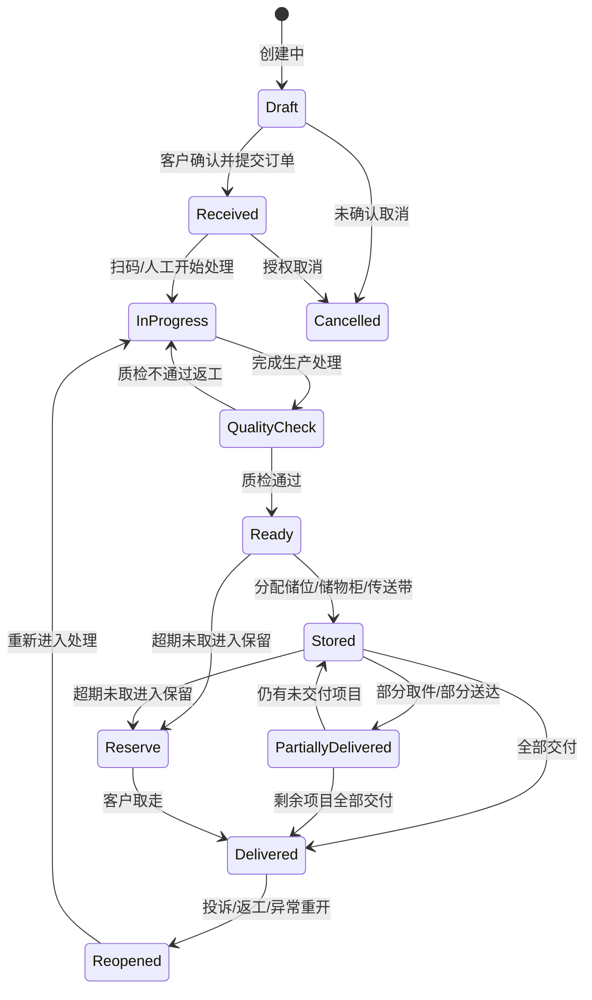

# Clean Hub PRD v0.1

| 版本 | 修改日期   | 修改人 | 备注                 |
| ---- | ---------- | ------ | -------------------- |
| v0.1 | 2026.05.11 | 彦青   | 产品需求文档初始版本 |
| v0.1.1 | 2026.05.11 | yannqing | 优化文档定位、范围边界和项目交付口径 |
| v0.1.2 | 2026.05.11 | yannqing | 调整 PRD 目录结构，补充范围、依赖、风险与术语 |
|      |            |        |                      |

---

## 1. 文档概述

### 1.1 文档定位

本文档是 CleanHub 的**产品总 PRD**，用于统一业务目标、产品范围、核心模块、非功能需求、数据对象和阶段计划。它面向产品、项目、设计、研发、测试、实施和业务方，用于建立共同理解，并作为后续拆分详细需求、项目计划和验收材料的依据。

> **说明：本文档不是最终开发任务清单。**  
> PRD 负责回答“为什么做、做什么、做到什么业务范围”。具体页面、接口、数据库字段、测试用例、硬件型号和排期，需要在后续配套材料中继续拆分。

### 1.2 阅读对象

- **业务方 / 客户方**：确认 CleanHub 的业务范围、阶段目标和关键验收口径。
- **项目经理**：据此拆解里程碑、依赖、风险、资源和交付计划。
- **产品与设计**：据此拆分用户流程、页面清单、交互原型和详细业务规则。
- **研发与测试**：据此识别系统边界、核心数据对象、非功能要求和后续技术专题。
- **实施与支持团队**：据此准备门店上线、硬件配置、培训、支持和验收流程。

### 1.3 范围口径

本文档按 **CleanHub 完整项目**定义产品能力，覆盖 Phase 1、Phase 2 和 Phase 3。文档中出现的能力不代表都必须在 Phase 1 完成，具体交付顺序以第 9 章的阶段计划和后续独立的 Phase 范围文档为准。

| 范围类型 | 说明 |
| -------- | ---- |
| **完整产品范围** | 本 PRD 描述的 CleanHub 长期目标能力。 |
| **Phase 1 范围** | 首个商业试点必须完成的最小可营业闭环。 |
| **后续阶段范围** | Phase 2 / Phase 3 分阶段补齐的高级经营、平台化和智能化能力。 |
| **待确认范围** | 合同、阶段计划或原始材料存在冲突，需要客户和项目方书面确认的内容。 |

### 1.4 Scope 边界

| 类型 | 内容 |
| ---- | ---- |
| **In Scope** | CleanHub 完整产品能力定义、核心用户角色、核心业务流程、功能模块、非功能需求、数据对象概览、阶段范围和待确认事项。 |
| **Phase 1 In Scope** | 单店营业闭环、多租户基础、POS 下单收件、客户管理、基础状态流转、基础支付、打印、基础报表和首批硬件接入。 |
| **Out of Scope** | 本文档不展开页面级交互、详细 API、数据库字段、测试用例、硬件型号兼容表、正式项目排期和最终报价。 |
| **Pending Confirmation** | Phase 1 离线深度、硬件型号、支付服务商、WhatsApp/SMS 渠道、培训平台、AI 验收边界、合同范围冲突。 |

### 1.5 当前关键假设

- CleanHub 采用**多租户 SaaS** 模式，不是单店私有化收银系统。
- 门店实际使用端需要具备接近原生应用的体验，POS 不应依赖用户理解浏览器、域名或复杂后台入口。
- 系统从第一版开始需要考虑 `tenant_id`、`branch_id`、审计、软删除、设备 ID、离线同步和未来 RLS。
- Phase 1 的目标是**真实门店可营业**，不是一次性交付所有合同中的高级功能。
- 硬件、支付、WhatsApp/SMS、AI 和传送带等外部依赖需要单独确认型号、供应商、SDK/API、测试环境和验收边界。

### 1.6 暂不在本文档展开的内容

以下内容不在本 PRD 中展开到执行级细节，需要后续单独成文：

- Phase 1 范围与验收标准。
- 用户流程与页面清单。
- 权限矩阵。
- 离线同步专题需求。
- 支付财务专题需求。
- 硬件验收清单。
- Backlog / Epic / User Story 初稿。

> **批注：文档拆分原则**  
> 不建议把所有细节都塞进一份 PRD。CleanHub 范围大、终端多、硬件多、离线复杂，后续应采用“总 PRD + 专题文档 + Backlog”的方式推进。

## 2. 项目背景与目标

### 2.1 项目背景

**CleanHub** 是一套面向**塞内加尔及西非法语区市场**的洗护行业数字化管理系统，服务对象包括**压烫店、干洗店、洗衣房**及后续可扩展的**洗车门店**。项目目标不是建设一个简单的单店收银工具，而是建设一套可支持**多租户、多门店、离线营业、硬件接入和本地支付**的 **SaaS 平台**。

> **说明：** 本项目的核心难点不只在业务页面，而在于线下门店环境复杂：网络可能不稳定、硬件型号不统一、员工数字化能力差异较大、现金与移动支付并存，且衣物交付长期依赖人工记忆和纸质票据。

上述因素会导致**订单查找困难、衣物丢失风险高、财务对账不透明、员工操作难追溯、老板无法实时掌握门店经营情况**。因此，CleanHub 需要围绕 **“门店稳定营业、总部统一管理、平台规模化扩张”** 这一核心目标设计。

系统不仅要支持前台快速收衣下单、客户识别、衣物标签打印、订单状态追踪、收款、取件、财务报表和后台配置管理，还需要进一步覆盖**多门店管理、会员积分、预付套餐、B2B 月结、库存采购、员工管理、取送配送、营销通知、投诉处理、SaaS 订阅、平台支持、AI 识别与预测、自动化硬件集成**等完整业务能力。

本 PRD v0.1 面向 CleanHub 完整项目进行需求定义。Phase 1 是首个商业试点阶段，目标是先支撑一家实体门店正式营业；后续阶段将在同一套架构基础上逐步补齐企业级经营、平台化管理、自动化运营和智能化能力，最终形成可在塞内加尔及更广泛非洲市场复制部署的洗护行业 SaaS 平台。

> **批注：范围口径**  
> 本文档按 **CleanHub 完整项目**描述产品能力，不仅限于 Phase 1。后续若拆分迭代计划，需要在独立章节中明确每个阶段的交付范围与验收口径。

### 2.2 业务目标

**CleanHub 完整项目的业务目标**是交付一套可支撑**单店营业、多店经营、平台招商和长期运营**的洗护行业 SaaS 平台，具体包括：

1. **支持完整门店经营闭环**：客户到店、客户识别、创建订单、录入衣物或车辆信息、选择服务、自动计价、收款、打印小票与标签、追踪生产状态、入库储位、通知客户、完成取件或配送。
2. **支持多业务模式**：覆盖 Pressing 干洗/压烫、按公斤水洗、洗衣房、鞋类清洗、地毯按面积计价、裁缝修补、洗车和零售商品销售，并允许不同服务在同一门店或同一订单中组合使用。
3. **建立 SaaS 多租户平台能力**：平台方可创建、启用、停用和管理租户；支持租户订阅、套餐权限、试用、续费、欠费提醒和平台级经营报表；不同租户之间的数据必须隔离。
4. **支持租户多门店管理**：一个租户可管理多个分店，Owner 可查看全部门店汇总，分店经理仅查看授权门店；客户基础信息可跨门店共享，订单、付款和财务数据按分店归属管理。
5. **建立清晰的角色与权限体系**：支持平台超级管理员、租户 Owner、Manager、Cashier、Delivery、Workshop 等角色，并对删单、改价、退款、支付修正、重印标签、用户禁用等敏感操作进行权限限制和审计。
6. **支持本地化支付与财务管理**：覆盖现金、Wave、Orange Money、TPE/card、预付余额、套餐扣减、礼品卡、B2B 挂账、分期付款等支付场景，并提供 Z Report、营收报表、应收账款、VAT、员工绩效和多门店财务汇总。
7. **支持核心硬件和自动化设备**：接入小票打印机、矩阵衣物标签打印机、A4 发票打印机、便携蓝牙打印机、成品贴纸打印机、扫码枪、钱箱、EMV Android 一体机、客户副屏，并预留传送带/自动挂衣系统接口。
8. **支持离线优先能力**：在网络不可用时，POS 仍应支持客户查询、创建订单、收款记录、打印小票和标签；网络恢复后，订单、支付、状态流转、库存和审计数据应能够自动同步，并具备冲突检测、幂等处理和设备追踪能力。
9. **支持客户运营与营销增长**：提供客户档案、客户分类、个人价格、会员积分、预付套餐、生日优惠、推荐奖励、沉睡客户召回、限时促销、WhatsApp/SMS/Email 自动通知和 Google 评价引导。
10. **支持内部运营管理**：覆盖库存耗材、供应商采购、零售销售、员工档案、排班打卡、薪资/预支、设备维护、投诉处理、满意度调查、支持工单、自助修复工具和多级支持链路。
11. **支持数据分析和智能化能力**：提供基础报表、高级 BI、N vs N-1 趋势对比、客户留存、门店排名、员工绩效、库存预测、AI 污渍/缺陷识别、需求预测、智能预约排程和预测性维护。
12. **支持多语言和非洲市场扩展**：系统需支持法语和英语，并预留多币种、多国家、多时区、多支付渠道和不同税率配置能力，为后续从塞内加尔扩展到其他非洲市场提供基础。
13. **支持标准化交付与培训**：提供用户手册、管理员手册、技术员安装手册、操作视频、在线培训平台、安装验收表和现场培训脚本，使 CleanHub 能够由现场技术员规模化部署到不同门店。

> **批注：验收拆分**  
> 上述目标为完整项目目标，不代表所有能力必须在同一版本同时上线。后续需要结合合同、阶段计划和开发成本拆分为 Phase 1 / Phase 2 / Phase 3 的可验收范围。

### 2.3 产品成功标准

CleanHub 的成功不应只以“功能是否开发完成”衡量，而应以真实门店能否稳定营业、平台能否规模化交付、客户是否愿意持续使用为核心判断标准。

| 维度 | 成功标准 |
| ---- | -------- |
| **门店营业** | 店员可以独立完成客户识别、下单、收款、打印、状态更新和取件交付。 |
| **经营透明** | Owner / Manager 可以看到订单、营收、支付方式、待取订单、员工操作和门店表现。 |
| **数据可靠** | 订单、支付、交付、退款、改价、删除、重印等关键动作均可追溯。 |
| **离线可用** | 网络不稳定时，门店仍可完成基础营业动作，并在恢复网络后同步。 |
| **硬件可落地** | 已确认型号的打印机、扫码枪、钱箱和移动设备能在试点门店稳定使用。 |
| **多租户可扩展** | 平台可新增租户、分店和员工，不同租户数据隔离。 |
| **实施可复制** | 技术员可以按照标准流程完成门店安装、配置、培训和验收。 |

## 3. 产品概述

### 3.1 产品定位

CleanHub 定位为面向非洲洗护行业的**多租户 SaaS 运营管理平台**，以 **“门店 POS + 租户后台 + SaaS 平台后台 + 移动端 + 桌面端硬件壳”** 为核心产品形态，帮助洗护门店完成从客户接待、订单创建、衣物/车辆追踪、支付收款、生产管理、取件交付、财务对账到客户运营的全流程数字化。

CleanHub 的第一目标市场为**塞内加尔及西非法语区**，因此系统必须优先适配当地经营环境：**法语界面、本地移动支付、网络不稳定场景、低学习成本界面、蓝牙/USB/Wi-Fi 外设、本地现金管理和多门店扩张诉求**。

> **说明：产品边界**  
> CleanHub 不是单一 Web 后台，也不是单一 POS。它是一套由多个终端共同组成的业务系统，各终端共享同一套租户、权限、订单、支付和报表数据。

### 3.2 产品形态

从产品层级看，CleanHub 包含**四类核心产品**：

1. **SaaS Admin**：平台超级管理员系统，用于 iWash / CleanHub 平台方管理租户、订阅、全局配置、平台经营数据和支持体系。
2. **Tenant Admin**：租户后台管理系统，用于商户 Owner/Manager 管理自己的门店、员工、客户、服务目录、价格、订单、财务、硬件配置和经营报表。
3. **POS Client**：门店收银和生产操作系统，用于收银员、店员和生产人员完成收衣、下单、收款、打印、扫码、状态流转、取件、离线营业等高频操作。
4. **Mobile / Desktop Shell**：移动端和桌面端壳，用于承载 POS 或老板端能力，并接入摄像头、GPS、蓝牙打印、扫码枪、钱箱、标签打印机等本地设备能力。

从业务层级看，CleanHub 不只服务单一洗衣业务，而是逐步覆盖**干洗/压烫、按公斤水洗、自助洗衣房、鞋类清洗、地毯清洗、裁缝修补、洗车、零售商品销售**等多个门店经营模式。

### 3.3 用户角色

#### 3.3.1 平台级角色

- **Super Admin / iWash Group**：管理所有租户、订阅计划、平台指标、全局配置、支持工单、技术员培训与部署。
- **CleanHub Support Team**：处理 Level 2 支持工单、远程协助、支付/消息/API 问题、同步问题。
- **Developer Team**：Level 3 支持，仅处理严重系统问题，不直接联系门店客户。

#### 3.3.2 商户级角色

- **Owner**：拥有最高业务权限，查看所有门店汇总，审批退款、删单、重印标签、价格管理、用户管理、订阅付款等。
- **Manager**：管理分店日常运营、价格、库存、员工排班、投诉处理、财务报表；部分高风险操作需要授权或原因。
- **Cashier / Agent**：创建订单、收款、打印、扫描、交付；不能删除订单，不能查看敏感财务总报表。
- **Delivery**：只查看和更新分配给自己的取送任务，支持部分交付，但不能处理部分付款/押金。
- **Workshop / Technician**：生产线扫描、状态流转、Kanban 操作，权限应与收银/财务隔离。

> **批注：角色命名**  
> `Technician` 在文档中可能同时指“生产技师”和“现场技术员”。后续详细 PRD 中建议统一命名：生产岗位使用 **Workshop Staff**，现场安装/维护岗位使用 **Field Technician**。

#### 3.3.3 客户侧角色

- **Walk-in Customer**：到店客户，通过手机号、姓名、小票、二维码或会员身份完成订单识别和取件。
- **B2B Customer**：企业客户，如酒店、公司、机构等，可使用月结、信用额度、批量对账和合并发票能力。
- **Delivery Customer**：使用上门取送服务的客户，可接收 WhatsApp/SMS 通知、查看配送状态和完成签收确认。

#### 3.3.4 技术交付角色

- **Field Technician**：现场技术员，负责门店安装、设备连接、打印机/扫码枪/钱箱配置、基础培训和现场排障。
- **Implementation Manager**：部署负责人，负责新租户上线、数据初始化、硬件清单确认、培训验收和上线检查。

### 3.4 功能模块总览

CleanHub 的核心功能模块应按**业务能力**划分，而不是按前端系统或终端划分。一个功能模块可能同时出现在 `SaaS Admin`、`Tenant Admin`、`POS Client`、`Mobile` 或 `Desktop Shell` 中，但它们共享同一套业务规则、权限、数据模型和审计逻辑。

> **说明：本节只做模块总览。**  
> 每个模块的详细目标、角色、功能范围和关键规则在 **第 5 章：功能需求说明** 中展开。

| 模块 | 核心职责 | 主要使用端 |
| ---- | -------- | ---------- |
| **平台与租户管理** | 管理 SaaS 租户、平台基础配置和租户生命周期 | SaaS Admin |
| **SaaS 订阅与计费管理** | 管理试用期、订阅计划、租户付款、套餐权限、欠费提醒和停用策略 | SaaS Admin / Tenant Admin |
| **门店与组织管理** | 管理租户下的多门店、营业时间、分店配置和组织关系 | Tenant Admin |
| **系统配置、安全与审计** | 管理语言、货币、税率、审计日志、数据保留、敏感字段和安全策略 | SaaS Admin / Tenant Admin / API |
| **用户、角色与权限** | 管理平台角色、租户角色、员工账号、权限边界和敏感操作控制 | SaaS Admin / Tenant Admin / POS |
| **客户与 CRM** | 管理客户档案、客户分类、客户识别、历史订单、积分、特殊价格和客户运营 | Tenant Admin / POS / Mobile |
| **企业客户、发票与应收账款** | 管理 B2B 客户、信用额度、月结、对账单、合并发票和逾期应收 | Tenant Admin / POS |
| **服务目录与价格** | 管理 Article、服务类型、计价方式、价格表、标签规则和套餐配置 | Tenant Admin / POS |
| **业务线能力管理** | 管理洗衣压烫、按公斤洗衣、自助洗衣、洗车、鞋类、地毯、裁缝等业务差异 | Tenant Admin / POS / Mobile |
| **订单与收件管理** | 处理客户到店/预约、订单创建、衣物/车辆录入、缺陷记录、照片和客户确认 | POS / Mobile |
| **预约、取送与配送管理** | 管理预约日历、上门取衣、配送任务、配送费用、区域规则、GPS 和 ETA | POS / Mobile / Tenant Admin |
| **生产状态与交付管理** | 管理衣物/车辆处理状态、质检、返工、储位、取件、部分交付和配送交付 | POS / Mobile / Tenant Admin |
| **支付与财务管理** | 支持现金、Wave、Orange Money、TPE、挂账、分期、Z Report 和营收报表 | POS / Tenant Admin / SaaS Admin |
| **硬件与打印管理** | 管理小票、衣物标签、成品贴纸、扫码枪、钱箱、客户副屏和未来传送带接口 | POS / Desktop / Mobile / Tenant Admin |
| **离线同步与设备管理** | 支持离线操作、本地队列、设备 ID、数据同步、冲突检测和幂等处理 | POS / Desktop / Mobile / API |
| **库存、采购与运营管理** | 管理耗材库存、供应商、采购、零售商品、机器维护和运营辅助能力 | Tenant Admin / POS |
| **员工、绩效与 HR** | 管理员工档案、排班、打卡、绩效、提成、工资和预支 | Tenant Admin |
| **营销、通知与会员增长** | 管理 WhatsApp/SMS/Email 通知、积分、套餐、生日优惠、召回和评价引导 | Tenant Admin / POS / Mobile |
| **投诉、满意度与支持** | 管理客户投诉、事故证据、退款审批、满意度调查、支持工单和自助修复 | Tenant Admin / SaaS Admin / Support |
| **实施、支持与培训管理** | 管理门店上线、技术员配置、支持工单、自助修复、远程协助和培训交付 | SaaS Admin / Support / Tenant Admin |
| **报表、BI 与 AI** | 提供经营报表、财务分析、N vs N-1、高级 BI、AI 检测和预测能力 | Tenant Admin / SaaS Admin / Mobile |

## 4. 核心业务流程

### 4.1 门店主流程

CleanHub 的核心业务不是单一后台管理流程，而是围绕 **“客户到店/预约 -> 门店收件 -> 生产处理 -> 就绪通知 -> 取件/配送 -> 财务对账”** 的门店经营闭环展开。不同业务对象包括**衣物、按公斤洗衣袋、鞋、地毯、车辆**等，但在系统中都应进入统一的**订单、支付、状态追踪和交付链路**。

> **说明：流程图阅读方式**  
> 下图描述完整业务主干流程。不同门店可按实际业务启用其中一部分能力，例如单纯压烫店可以不启用洗车，暂不做配送的门店可以跳过配送分支。

```mermaid
flowchart TD
    Start(["客户进入门店 / 电话预约 / WhatsApp 预约 / 配送上门取件"])

    Start --> Identify["POS 店员识别客户"]
    Identify --> Existing{"是否已有客户档案？"}
    Existing -->|是| LoadCustomer["加载客户档案、等级、特殊价格、欠款、历史订单"]
    Existing -->|否| CreateCustomer["创建客户档案：姓名、电话、地址、生日可选"]
    CreateCustomer --> SelectBusiness
    LoadCustomer --> SelectBusiness

    SelectBusiness{"选择业务类型"}
    SelectBusiness --> Pressing["衣物类：干洗 / 压烫 / 水洗 / 鞋 / 地毯 / 裁缝"]
    SelectBusiness --> LaundryKg["按公斤洗衣：称重、整袋/整捆计价"]
    SelectBusiness --> CarWash["洗车：车牌、车型、套餐、车辆状况"]

    Pressing --> GarmentIntake["逐件录入：衣物类型、颜色、服务、缺陷、备注、照片"]
    LaundryKg --> BagIntake["录入重量、套餐、袋数、最小/最大重量校验"]
    CarWash --> VehicleIntake["录入车辆照片、油量、贵重物品、已有损伤、客户签名"]

    GarmentIntake --> Price
    BagIntake --> Price
    VehicleIntake --> Price

    Price["系统计价：标准价 / 客户分类价 / 个人特殊价 / 折扣 / 加急费"]
    Price --> Confirm["POS 展示订单摘要，客户确认"]
    Confirm --> Payment{"收款方式"}

    Payment --> Cash["现金：记录收款，触发钱箱"]
    Payment --> MobilePay["Wave / Orange Money：发起支付并等待确认"]
    Payment --> Card["TPE/Card：终端支付确认"]
    Payment --> Credit["挂账 / B2B 月结 / 分期 / 预付余额 / 套餐扣减"]

    Cash --> Print
    MobilePay --> PayStatus{"支付是否确认？"}
    Card --> PayStatus
    Credit --> Print
    PayStatus -->|成功| Print["打印客户小票、衣物标签/袋标签/车辆单据"]
    PayStatus -->|失败或待确认| PendingPay["标记待支付/待确认，保留订单和支付尝试记录"]
    PendingPay --> Print

    Print --> ProductionQueue["订单进入生产队列"]
    ProductionQueue --> Received["Received 已收件"]
    Received --> InProgress["In Progress 处理中"]
    InProgress --> ProcessType{"处理工序"}
    ProcessType --> Washing["洗涤"]
    ProcessType --> Drying["烘干"]
    ProcessType --> Ironing["熨烫/压烫"]
    ProcessType --> Folding["折叠/包装"]
    ProcessType --> CarSteps["洗车步骤：预冲、清洗、冲洗、干燥、内饰、收尾"]

    Washing --> QC["Quality Check 质检"]
    Drying --> QC
    Ironing --> QC
    Folding --> QC
    CarSteps --> QC

    QC --> Ready{"是否通过质检？"}
    Ready -->|否| Rework["返工 / 重新处理 / 记录原因"]
    Rework --> InProgress
    Ready -->|是| Storage["Ready 就绪，分配储位/储物柜/传送带位置"]

    Storage --> Notify["WhatsApp / SMS 通知客户可取件或准备配送"]
    Notify --> DeliveryChoice{"交付方式"}
    DeliveryChoice --> StorePickup["客户到店取件"]
    DeliveryChoice --> Delivery["配送员送回"]

    StorePickup --> SearchOrder["POS 通过客户、订单号、二维码、手机号查找订单"]
    SearchOrder --> Partial{"是否部分交付？"}
    Partial -->|是| PartialDelivery["记录已交付明细，剩余项目继续保留"]
    Partial -->|否| FullDelivery["扫描确认全部交付"]
    PartialDelivery --> Balance["结算剩余金额或保持欠款"]
    FullDelivery --> Balance

    Delivery --> DeliveryTask["配送员更新出发、到达、签收、收款状态"]
    DeliveryTask --> Balance

    Balance --> CloseOrder{"订单是否全部交付且财务完成？"}
    CloseOrder -->|是| Delivered["Delivered 已交付，订单关闭"]
    CloseOrder -->|否| ActiveOrder["订单保持未完成/部分交付/欠款状态"]

    Delivered --> Finance["进入财务统计、Z Report、员工绩效、客户历史"]
    ActiveOrder --> FollowUp["进入待取、欠款、逾期提醒或应收账款"]
    FollowUp --> Finance
    Finance --> Reports["Tenant Admin 查看门店报表；SaaS Admin 查看平台汇总"]
```

> **批注：离线同步约束**  
> 离线场景下，POS Client 需要在本地数据库中先保存客户、订单、支付尝试、打印记录、状态流转、储位分配和交付动作。网络恢复后，客户端按操作队列同步到服务端。服务端根据**租户、分店、用户、设备、版本号、客户端操作 ID 和支付幂等键**进行校验，避免重复收款、重复交付、覆盖其他终端数据或跨租户写入。

### 4.2 订单状态流转

**核心状态建议如下：**

> **说明：状态机适用范围**  
> 该状态机适用于衣物、按公斤洗衣袋、鞋类、地毯和车辆等订单对象。具体业务可以扩展子工序，但不应破坏订单主状态的可追踪性。

## 5. 功能需求说明

> **说明：章节口径**  
> 本章按**业务功能模块**展开，而不是按 `web-admin`、`pos-web`、`mobile`、`desktop` 等技术端展开。后续做系统设计时，可以再把每个业务模块拆分到不同终端中实现。

### 5.1 平台与租户管理

平台与租户管理用于支撑 CleanHub 的 SaaS 商业模式，主要面向 **Super Admin / iWash Group**、CleanHub 支持团队和实施人员。平台方需要能够创建租户、维护租户基础资料、分配唯一的 `Pressing Code`、管理订阅计划、控制功能开关，并查看平台整体经营情况。

该模块需要支持租户启用、暂停、欠费、停用等生命周期管理。租户停用后应限制新增业务操作，但不能删除历史订单、客户、财务和审计数据。平台管理员可以在必要时进入租户视角排查问题，但**所有平台代操作必须记录审计日志**。

> **批注：RLS 约束**  
> PostgreSQL 表结构从第一版开始必须包含 `tenant_id`，并为后续 RLS 行级安全预留策略。

### 5.2 SaaS 订阅与计费管理

SaaS 订阅与计费管理用于支撑 CleanHub 的商业化运营，主要面向平台管理员和租户 Owner。系统需要管理试用期、订阅计划、套餐权益、租户付款记录、多币种收费、欠费提醒、功能开关和停用策略。

不同订阅计划可以控制多门店、高级 BI、AI、满意度调查、白标、API、支持级别等能力。租户欠费或订阅到期时，系统应按策略限制新增业务或高级功能，但不能删除历史数据。**订阅停用、功能降级、付款修正和人工延长期都必须记录审计日志**。

### 5.3 门店与组织管理

门店与组织管理用于支持一个租户管理多个实体门店。Owner 可以查看所有门店，Manager 通常只能管理授权门店。系统需要管理门店名称、地址、电话、营业时间、默认语言、默认货币、启用状态和分店经营看板。

订单、支付、退款、Z Report、员工操作和库存变动都需要明确归属到具体门店。**客户基础资料可以在同一租户内共享，但订单、财务和经营数据应按门店权限控制可见范围**。

### 5.4 系统配置、安全与审计

系统配置、安全与审计是贯穿所有业务模块的基础能力。系统需要支持租户级语言、货币、税率、VAT、营业时间、通知模板、打印模板、编号规则、数据保留策略和安全策略配置，并允许部分配置按门店覆盖。

安全层面需要覆盖租户隔离、RLS 预留、敏感字段加密、软删除、审计日志、权限变更记录、异常登录提醒和设备禁用。**删除、退款、改价、支付方式修正、重印、权限变更、用户禁用、订阅停用等操作必须审计，审计日志不能被普通管理员修改或删除**。

### 5.5 用户、角色与权限

用户、角色与权限模块用于保障系统操作安全，覆盖平台管理员、租户 Owner、Manager、Cashier / Agent、Delivery、Workshop Staff 等角色。系统需要支持员工账号、角色分配、门店绑定、PIN 或密码登录、账号启用/禁用和自动锁屏。

删单、退款、改价、支付修正、重印标签、打开钱箱等敏感操作必须进行权限校验、二次确认、原因填写和审计记录。**权限必须在服务端校验，不能只依赖前端隐藏按钮**。所有关键操作还应记录 `user_id` 和 `device_id`，用于确认“谁在什么设备上完成了操作”。

### 5.6 客户与 CRM

客户与 CRM 模块用于建立客户档案、支持快速找单、客户分类定价、历史订单追踪和后续会员运营。POS 店员需要能够通过手机号、姓名、会员卡、旧订单号、二维码或条码快速识别客户；当多个客户使用同一手机号时，系统应展示候选档案，由店员人工确认。

客户档案应包含姓名、电话、地址、邮箱、生日、客户分类、备注、消费历史、欠款、投诉和满意度等信息。系统需要支持 Regular、VIP、Corporate 等分类，并允许为特定客户设置个人特殊价。**会员权益属于客户本人，不应依赖小票或纸质卡作为唯一凭证**。

### 5.7 企业客户、发票与应收账款

企业客户、发票与应收账款模块用于支持 B2B 客户、集团客户、酒店、办公室、车队或长期合作客户的月结业务。系统需要维护企业客户档案、联系人、信用额度、付款周期、合同价、税务信息、发票抬头和账期规则。

企业客户可以先挂账，后续按周期生成对账单和发票。多分店集团客户可合并发票，但订单仍需保留原始门店归属。系统应提供应收账款仪表板，展示客户、金额、逾期天数、所属门店和催收状态。**信用额度超限、账期逾期、发票作废和应收修正都需要权限控制和审计记录**。

### 5.8 服务目录与价格

服务目录与价格是 POS 下单、自动计价、打印标签和财务统计的基础。系统需要支持干洗、压烫、水洗、鞋类、地毯、洗车、零售商品等服务分类，并管理具体 Article、服务名称、显示顺序、计价方式和标签规则。

价格体系需要支持标准价、客户分类价、个人特殊价、门店价、套餐价和折扣。推荐价格优先级为：**个人特殊价 > 客户分类价 > 标准价格**。价格修改后可以即时生效，但不得影响已确认订单的历史金额，所有价格变更都应进入审计日志。

### 5.9 业务线能力管理

业务线能力管理用于描述不同服务业态的差异化需求，避免把所有业务都粗暴当成普通衣物订单处理。CleanHub 需要覆盖洗衣/压烫、按公斤洗衣、自助洗衣、鞋类、地毯、大件、裁缝、洗车等业务线，并允许租户按自身经营范围启用或关闭。

不同业务线应支持不同的收件字段、计价方式、打印模板、状态节点和验收要求。例如按公斤洗衣需要重量、袋数、最小/最大重量；洗车需要车牌、车型、车辆照片、油量、客户签名；自助洗衣可能涉及机器、程序、代币或时长。**业务线差异应通过配置和扩展字段表达，避免为每一种业务复制一套完全独立的订单系统**。

### 5.10 订单与收件管理

订单与收件管理是 POS 的核心模块，用于完成客户到店或预约后的订单创建、服务选择、缺陷记录、照片采集、价格确认和订单提交。店员需要能快速选择客户、业务类型、服务项目、数量、重量、尺寸、取件日期和支付方式。

不同业务对象需要不同的收件信息：衣物类需要记录衣物类型、颜色、服务、缺陷、备注、护理码和照片；按公斤水洗需要记录重量、袋数和套餐；地毯或大件需要记录尺寸、面积和最低收费；洗车需要记录车牌、车型、油量、车内物品、车辆照片和客户签名。**订单确认后再修改，必须记录修改原因和审计日志**。

### 5.11 预约、取送与配送管理

预约、取送与配送管理用于覆盖客户预约、上门取衣、门店取件、配送送回和配送员任务。客户可以通过电话、WhatsApp、柜台或移动端预约未来送洗、上门取衣或送回时间；门店需要通过日历查看预约、分配配送员、调整时段和管理配送容量。

配送员移动端需要展示任务、客户地址、联系方式、订单明细、收款状态和签收状态，并支持现场拍照、创建订单、收取押金、打印便携取件单。系统可配置配送区域、配送费用、距离规则和 ETA。若启用 GPS，配送员设备必须预注册，并支持异常登录告警和远程锁定。**配送状态、位置更新、签收和现场收款都必须进入订单与财务追踪链路**。

### 5.12 生产状态与交付管理

生产状态与交付管理用于追踪订单对象从收件到交付的全过程，降低衣物丢失、漏处理、错交付和超期未取风险。系统应支持 Draft、Received、In Progress、Quality Check、Ready、Stored、Partially Delivered、Delivered、Reserve、Cancelled、Reopened 等状态。

该模块需要支持扫码流转、生产看板、质检返工、储位管理、Ready 通知、到店取件、配送交付、部分交付和超期保留。**每一次状态变化都必须记录操作者、设备、时间和门店**；交付必须有明确确认动作，不能只依赖人工口头确认。

### 5.13 支付与财务管理

支付与财务管理用于支持门店收款、退款、挂账、日结和经营分析。系统需要支持现金、Wave、Orange Money、TPE/card、B2B 月结、分期付款、预付余额和套餐扣减等支付方式，并记录每笔交易的来源订单、操作人、门店、设备和状态。

Z Report 是门店财务闭环的重要节点，生成后对应周期内的交易应被锁定，避免后续随意修改。退款、支付修正、挂账调整和钱箱打开都属于敏感操作，需要权限控制和审计。**支付、退款、库存扣减和状态事件都需要具备幂等处理能力**，避免离线重试或回调重复导致重复入账。

### 5.14 硬件与打印管理

硬件与打印管理用于连接门店真实设备，保证小票、衣物标签、成品贴纸、扫码枪、钱箱、客户副屏和未来传送带接口能够稳定工作。POS 和 Desktop Shell 需要承担主要硬件连接能力，Mobile 侧则主要负责便携蓝牙打印、拍照、扫码和配送场景。

系统需要支持 80mm 小票、矩阵/针式衣物标签、成品贴纸、A4 发票、USB/Bluetooth HID 扫码枪、现金钱箱和经济模式打印。硬件异常不应阻塞订单保存，但应提示用户并进入待打印或待处理队列。

> **批注：硬件责任边界**  
> 具体设备兼容范围需要在实施阶段形成“确认设备清单”。未确认设备不应默认纳入验收范围。

### 5.15 离线同步与设备管理

离线同步与设备管理用于保障门店在网络不稳定时仍能营业，并在网络恢复后将本地数据安全合并到云端。每台 POS、桌面端和移动端都需要生成稳定的 `device_id`，并在服务端登记设备归属、状态和最后同步时间。

断网时，系统应在本地数据库保存客户、订单、支付尝试、状态变化、打印任务和交付记录，并通过同步队列在网络恢复后按顺序提交。**客户端创建数据必须使用 ULID，不能依赖数据库自增 ID，也不能使用 PostgreSQL `uuid` 主键作为业务 ID**。业务表需要预留 `version`、`created_device_id`、`updated_device_id`、软删除字段和客户端操作 ID，用于冲突检测、幂等处理和审计追踪。

### 5.16 库存、采购与运营管理

库存、采购与运营管理用于帮助门店管理洗涤剂、标签纸、衣架、包装袋、零售商品和机器设备，减少耗材断货和运营不可见问题。系统需要支持库存档案、入库、出库、报损、调拨、最低库存预警、供应商管理和采购订单。

如果 POS 销售零售商品，如洗涤剂、衣架、洗衣袋或车载香氛，系统应自动扣减库存。机器维护也应纳入运营记录，用于追踪洗衣机、烘干机、洗车设备等资产的维护、故障和成本。**库存变动必须以流水形式记录，不应只覆盖当前数量**。

### 5.17 员工、绩效与 HR

员工、绩效与 HR 模块用于支持门店人员管理、考勤、绩效分析和基础薪资记录。系统需要维护员工档案、角色、所属门店、入职信息、合同类型、排班、签到/签退、迟到、早退和加班记录。

绩效分析应与订单、支付、折扣、取消、投诉和处理时长关联，帮助 Owner 和 Manager 发现异常操作或培训需求。**员工操作必须绑定真实账号，禁止多人共用账号**；离职员工应立即禁用账号，但历史绩效和审计记录需要保留。

### 5.18 营销、通知与会员增长

营销、通知与会员增长模块用于提升客户复购、减少电话咨询、推动客户及时取件，并帮助门店进行会员运营。系统应支持订单创建通知、订单就绪通知、逾期未取提醒、配送确认、生日优惠、沉睡客户召回、推荐奖励和 Google 评价引导。

消息渠道以 WhatsApp Business API 为主，SMS 可作为备用，Email 可用于报表或补充通知。所有通知都需要记录发送状态、渠道、时间和失败原因。优惠券、积分、预付余额和套餐抵扣需要进入订单与财务记录，避免营销数据和财务数据脱节。

### 5.19 投诉、满意度与支持

投诉、满意度与支持模块用于处理服务纠纷、记录证据、管理赔付和提升客户服务质量，同时支撑 CleanHub 的技术支持体系。投诉应能关联订单、客户、收件照片、缺陷记录、客户签名、支付记录和交付记录。

处理方案可包括免费返工、优惠券、店内余额、部分退款或全额退款。退款类处理需要 Owner 授权，并记录审批人、原因和金额。支持团队可以通过工单和远程协助帮助门店排查问题，但**支持人员访问租户数据必须记录审计日志**，远程协助也应由门店主动发起并可随时结束。

### 5.20 实施、支持与培训管理

实施、支持与培训管理用于覆盖门店上线交付、技术员配置、客户培训和长期支持链路。系统或交付流程需要支持门店初始化、设备配置、打印测试、支付测试、通知测试、账号开通、数据导入、上线检查和客户签收。

支持体系应区分 Level 1 门店内部支持、Level 2 CleanHub 支持团队、Level 3 开发团队，并通过工单记录问题、处理人、处理时间、处理结果和影响范围。自助修复工具可用于安全地执行重建索引、重新同步、重新发送通知、检查打印配置等操作。若在线技术员培训平台属于合同范围，还需要支持视频、PDF、练习、测验、证书和培训有效期管理。

### 5.21 报表、BI 与 AI

报表、BI 与 AI 模块用于帮助 Owner、Manager 和平台方理解经营情况、发现异常、提升效率，并逐步形成智能化运营能力。基础报表应覆盖今日营收、订单数、待取订单、进行中订单、支付方式汇总、员工绩效、客户留存、应收账款、退款、折扣、VAT、支出和利润。

多门店租户需要门店对比、N vs N-1、目标对比和经营趋势分析；平台方需要查看租户数量、活跃门店、平台订单量和平台收入等汇总数据。AI 能力可逐步扩展到污渍/缺陷识别、需求预测和预测性维护，但**AI 结果只能作为辅助建议，不应自动替代员工确认**。跨租户平台报表必须脱敏或仅展示汇总数据。

## 6. 非功能性需求

### 6.1 可用性与稳定性

CleanHub 面向真实门店营业场景，系统必须优先保障 POS 下单、收款、打印、查单和交付等核心链路稳定可用。即使后台报表、营销或 AI 功能出现异常，也不应影响门店完成基础营业。

门店端应具备基础容错能力：网络中断、打印机离线、支付回调延迟、第三方短信或 WhatsApp 服务异常时，系统需要给出清晰状态，并允许用户继续完成可离线保存的业务动作。

### 6.2 性能要求

POS 高频操作需要保持快速响应。常用页面如客户搜索、服务选择、订单录入、扫码查单、支付确认和打印任务应避免长时间等待。后台报表、BI、导出和 AI 分析可以采用异步任务，避免阻塞前台收银。

> **建议指标**  
> POS 常用操作响应目标应控制在 1 秒以内；复杂报表可以异步生成，但需要展示生成状态和失败原因。

### 6.3 离线能力

POS、Desktop 和 Mobile 端需要支持基础离线营业能力。断网时，系统至少应允许本地创建客户、创建订单、记录衣物/车辆、保存支付尝试、打印标签/小票、更新基础状态和记录交付动作。网络恢复后，客户端通过同步队列将本地操作提交到服务端。

离线数据同步必须考虑冲突检测、幂等处理、服务端时间校准、软删除同步和设备身份识别。**支付、退款、库存扣减、交付确认等高风险操作必须有幂等键和服务端二次校验**。

### 6.4 安全与权限

系统必须支持多租户数据隔离、RBAC 权限控制、分店级数据范围控制、敏感操作审计和设备管理。API 层必须强制校验权限，不能只依赖前端菜单或按钮隐藏。

敏感数据如手机号、邮箱、支付引用、第三方接口密钥等应按安全等级进行保护。租户数据、员工账号、审计日志和财务记录不得被普通用户物理删除。

### 6.5 数据可靠性与备份

系统需要保证订单、支付、交付、库存、审计等关键数据可追溯。业务表应保留创建时间、更新时间、创建人、更新人、软删除字段、租户 ID 和必要的设备信息。

云端数据库需要定期备份，并具备恢复机制。对于离线客户端，需要防止本地数据损坏、重复同步和部分同步失败导致的数据不一致。

### 6.6 硬件兼容性

系统需要支持门店常见硬件，包括 80mm 热敏小票机、矩阵/针式标签打印机、成品贴纸打印机、扫码枪、现金钱箱、便携蓝牙打印机、A4 打印机和可能的 TPE 支付终端。

> **批注：硬件验收边界**  
> 具体支持型号、驱动、协议、耗材和连接方式需要在实施阶段确认。未确认设备不应默认进入验收范围。

### 6.7 国际化与本地化

CleanHub 面向塞内加尔及西非法语区，需要支持至少法语和英语界面。菜单、按钮、通知、小票、标签、短信、WhatsApp 模板、PDF 发票和报表应具备多语言能力。

系统还需要支持租户级货币、税率、时间格式、日期格式、电话号码格式和本地营业时间配置。

### 6.8 可观测性与运维

系统需要记录关键业务日志、错误日志、同步日志、支付回调日志、通知发送日志和硬件任务日志。支持团队应能定位某个租户、门店、设备、订单或支付事件的完整链路。

后台应提供基础健康检查和异常告警能力，例如同步失败、支付回调失败、通知发送失败、设备长时间未同步、库存异常、钱箱异常打开等。

### 6.9 可扩展性与可维护性

系统架构需要支持多租户、多门店、多终端和多业务线扩展。业务规则应尽量沉淀在后端和共享领域模型中，避免不同终端各自实现一套不一致逻辑。

后续扩展 AI、开放 API、白标、多国家、多币种和更多硬件时，不应破坏现有订单、支付、状态、审计和离线同步主链路。

## 7. 数据字典概览

> **说明：本章只做概览。**  
> 这里不展开完整字段、索引、枚举和 ER 图，详细数据库设计应在技术设计文档中完成。

| 数据对象 | 说明 | 关键字段示例 |
| -------- | ---- | ------------ |
| **Tenant 租户** | SaaS 平台下的商户主体 | 租户名称、Pressing Code、国家、货币、语言、订阅状态 |
| **Subscription 订阅** | 租户订阅计划和付款记录 | 计划、试用期、付款状态、到期时间、功能开关 |
| **Branch 门店** | 租户下的实体门店 | 门店名称、地址、电话、营业时间、状态 |
| **User 用户/员工** | 平台人员和门店员工账号 | 姓名、角色、门店范围、登录凭证、状态 |
| **Role / Permission 角色权限** | 菜单、按钮、API 和数据范围控制 | 角色名称、权限点、适用租户、适用门店 |
| **Customer 客户** | 个人客户或企业联系人 | 姓名、电话、地址、分类、积分、生日 |
| **Corporate Account 企业客户** | B2B 月结客户 | 企业名称、联系人、信用额度、账期、发票信息 |
| **Service / Article 服务项目** | POS 可售卖的服务或商品 | 分类、名称、计价方式、标签规则、状态 |
| **Price Rule 价格规则** | 标准价、分类价、个人特殊价 | 适用服务、客户分类、客户、门店、价格 |
| **Order 订单** | 客户一次消费或服务请求 | 订单号、客户、门店、状态、总价、取件日期 |
| **Order Item 订单明细** | 衣物、袋、车辆、商品等明细对象 | 类型、服务、数量、重量、颜色、缺陷、状态 |
| **Garment / Asset 衣物/对象** | 可追踪的具体衣物、车辆或大件 | 条码、照片、缺陷、储位、当前状态 |
| **Payment 支付** | 订单收款、退款和支付尝试 | 金额、方式、状态、支付引用、幂等键 |
| **Invoice / Receivable 发票与应收** | 企业客户对账、发票和应收账款 | 客户、账期、金额、逾期状态、发票号 |
| **Appointment 预约** | 预约到店、取衣或配送 | 客户、时间、地址、类型、状态 |
| **Delivery Task 配送任务** | 配送员取送任务 | 配送员、地址、ETA、GPS、签收状态 |
| **Storage Location 储位** | 货架、储物柜、传送带槽位 | 区域、编号、状态、当前订单/衣物 |
| **Inventory Item 库存项目** | 耗材、商品和设备相关库存 | 名称、单位、库存量、阈值、成本 |
| **Inventory Movement 库存流水** | 入库、出库、报损、调拨 | 类型、数量、来源、目标、关联订单 |
| **Notification 通知记录** | WhatsApp、SMS、Email 发送记录 | 渠道、模板、接收人、状态、失败原因 |
| **Complaint 投诉** | 客户投诉、事故和赔付处理 | 类型、订单、证据、处理方案、状态 |
| **Support Ticket 支持工单** | 门店或平台支持请求 | 问题类型、优先级、处理人、状态 |
| **Device 设备** | POS、Desktop、Mobile 和硬件终端 | device_id、设备类型、门店、状态、最后同步时间 |
| **Sync Operation 同步操作** | 离线操作队列和同步记录 | 操作 ID、设备、业务对象、状态、错误信息 |
| **Audit Log 审计日志** | 关键操作的不可抵赖记录 | 操作人、设备、对象、动作、时间、变更内容 |
| **Report Snapshot 报表快照** | Z Report 或周期报表结果 | 门店、周期、统计口径、生成时间、锁定状态 |

所有核心业务数据原则上应包含 `tenant_id`。门店相关数据应包含 `branch_id`。业务实体主键和跨表引用 ID 统一使用 ULID。需要离线同步的数据应包含稳定主键、版本号、创建/更新设备、创建/更新时间、软删除字段和必要的幂等键。

## 8. 第三方依赖与硬件边界

> **说明：本章只定义依赖类别和确认边界。**  
> 具体供应商、接口文档、硬件型号、测试账号、SDK、费用和验收方法，需要在后续专题文档中确认。

| 依赖类别 | 说明 | 当前边界 |
| -------- | ---- | -------- |
| **移动支付** | Wave、Orange Money、TPE/card 或聚合支付服务 | 需确认服务商、API、回调机制、测试环境和对账规则。 |
| **消息通知** | WhatsApp Business API、SMS、Email | 需确认渠道供应商、模板审核、发送费用、失败重试和退订规则。 |
| **打印设备** | 80mm 小票、矩阵/针式标签、成品贴纸、A4、便携蓝牙打印 | 需确认型号、驱动、连接方式、耗材和平台兼容性。 |
| **扫码与钱箱** | USB/Bluetooth HID 扫码枪、现金钱箱 | 需确认触发协议、连接方式、异常处理和日志记录。 |
| **移动设备能力** | 摄像头、GPS、蓝牙、Android/iOS 权限 | 需确认设备型号、系统版本、权限策略和离线表现。 |
| **AI 能力** | 污渍/缺陷识别、预测分析、智能排程 | 初期仅作为辅助建议，准确率、模型来源和验收指标需单独确认。 |
| **自动化设备** | 传送带、自动挂衣、客户副屏等 | Phase 3 预留接口，实际接入需确认硬件协议和供应商支持。 |

> **批注：验收边界**  
> 未经双方确认的第三方服务、硬件型号、接口能力和外部费用，不应默认纳入开发验收范围。

## 9. 阶段范围与交付计划

> **说明：计划口径**  
> 本章用于描述阶段目标和建议范围，不替代正式项目排期。正式排期需要结合团队人数、技术方案、第三方依赖、硬件到货、客户确认和测试资源进一步拆分。

### 9.1 Phase 1：商业试点版

Phase 1 的目标是让单店可以正式营业、收钱、打印、追踪订单，并完成第一批真实门店试点。该阶段应优先保证 POS 主流程可用，而不是一次性实现全部高级能力。

建议范围包括：

- 多租户基础、Pressing Code、租户/门店基础配置。
- 基础 RBAC、员工账号、PIN/密码登录、敏感操作审计。
- 客户管理、服务目录、价格表、POS 下单和收件。
- 衣物/订单基础状态流转、扫码查单、基础储位。
- 现金、Wave、Orange Money 基础支付记录和待确认状态。
- 小票打印、标签打印、扫码枪、钱箱基础联动。
- 基础 Z Report、今日营收、订单统计和支付方式汇总。
- Windows/Desktop 初版、Android 初版、Web Admin 基础后台。
- 法语/英语基础 UI 和主要小票/标签模板。

> **批注：Phase 1 离线边界**  
> 原始材料里对 Phase 1 是否包含完整离线存在冲突。建议 Phase 1 至少支持**断网录单、断网打印、本地保存和恢复后同步上传**；完整双向冲突处理、复杂合并和离线报表可放到 Phase 2。

Phase 1 验收应以真实门店闭环为准：新客户下单、老客户找单、打印小票和标签、现金收款触发钱箱、移动支付记录、订单进入处理、Ready 通知、客户取件、生成基础 Z Report。

### 9.2 Phase 2：系统深化版

Phase 2 的目标是从“单店可用”升级为“多店可运营、离线更可靠、经营管理更完整”。该阶段重点补齐多门店、会员、B2B、配送、库存、员工和投诉等能力。

建议范围包括：

- 完整离线同步引擎、冲突检测、幂等处理和设备管理。
- 多门店后台、跨门店客户共享、分店权限和门店对比。
- 会员积分、预付余额、次数套餐、生日优惠和客户召回。
- B2B 企业客户、信用额度、月结、对账单和合并发票。
- WhatsApp/SMS 通知模板、发送记录和失败重试。
- 预约日历、上门取衣、配送任务、配送费用、GPS 和 ETA。
- 库存、供应商、采购、零售商品和机器维护。
- 员工排班、打卡、绩效、投诉和满意度调查。
- TPE/card 支付终端集成和更完整的财务报表。

Phase 2 验收应关注多角色、多门店、多设备并发使用下的数据一致性，尤其是离线同步、支付幂等、部分交付、B2B 月结和库存流水。

### 9.3 Phase 3：完整交付与扩展版

Phase 3 的目标是完成合同范围内的高级能力、平台化能力和规模化交付能力，使 CleanHub 从试点产品升级为可持续运营的 SaaS 平台。

建议范围包括：

- 高级 BI、N vs N-1、经营趋势、利润、客户留存和预测报表。
- AI 污渍/缺陷识别、面料风险提示、需求预测和预测性维护。
- 白标能力、开放 API、多租户套餐功能开关和更完整订阅计费。
- 传送带/自动挂衣接口、客户副屏和更多硬件适配。
- 支持工单、自助修复工具、远程协助记录和运维告警。
- 在线技术员培训平台、培训材料、练习、测验和证书。
- 真实数据试运行、用户培训、上线验收、客户签收和最终交付。

Phase 3 验收应关注平台级能力和长期可运营性，包括高级报表准确性、AI 辅助结果边界、开放 API 安全、硬件验收清单、培训交付物、支持流程和最终验收文档。

## 10. 待确认事项与风险

### 10.1 待确认事项

以下事项会直接影响范围、报价、排期和验收，需要在进入正式开发计划前确认：

| 待确认事项 | 影响 |
| ---------- | ---- |
| **Phase 1 离线范围** | 决定是否只做断网录单/打印，还是做完整双向同步和冲突处理。 |
| **硬件型号清单** | 决定打印、扫码、钱箱、TPE、蓝牙设备的开发和测试成本。 |
| **支付服务商与 API** | 决定 Wave、Orange Money、TPE/card 的接入方式、回调机制和对账规则。 |
| **WhatsApp/SMS 渠道** | 决定通知模板、发送成本、失败重试和客户触达能力。 |
| **培训平台是否纳入交付** | 决定是否需要单独建设视频、PDF、测验、证书和长期在线能力。 |
| **AI 功能验收边界** | 决定 AI 是演示级、辅助建议级，还是需要达到可量化准确率。 |
| **合同范围与阶段计划冲突** | 决定哪些能力属于本合同强制交付，哪些属于后续扩展或变更。 |
| **上线国家与税务规则** | 决定语言、货币、VAT、发票和本地化配置范围。 |

### 10.2 主要风险

| 风险 | 说明 |
| ---- | ---- |
| **范围膨胀风险** | 原始材料覆盖能力很多，如未明确阶段范围，Phase 1 容易失控。 |
| **离线复杂度风险** | 离线同步涉及冲突、幂等、支付、设备和数据一致性，需要单独设计。 |
| **硬件适配风险** | 不同打印机、扫码枪、钱箱和移动设备可能存在驱动或协议差异。 |
| **支付对账风险** | 移动支付回调、失败重试、重复通知和人工修正都可能影响财务准确性。 |
| **实施落地风险** | 门店现场网络、员工培训、设备安装和数据初始化会直接影响上线效果。 |

## 11. 后续配套材料

基于本文档，下一步建议优先拆分以下材料，供项目经理、设计、研发、测试和实施团队使用：

1. **Phase 1 范围与验收标准**：明确第一阶段必须交付、明确不交付和验收场景。
2. **用户流程与页面清单**：拆分 SaaS Admin、Tenant Admin、POS、Mobile、Desktop 的页面和主流程。
3. **权限矩阵**：明确不同角色在不同终端、门店和数据范围内的查看、创建、修改、审批和删除权限。
4. **离线同步专题需求**：定义离线数据范围、同步队列、冲突处理、设备 ID、版本号和幂等规则。
5. **支付财务专题需求**：定义支付状态机、退款、Z Report、B2B 月结、发票、对账和异常处理。
6. **硬件验收清单**：确认设备型号、连接方式、系统平台、测试方法和验收边界。
7. **Backlog / Epic / User Story 初稿**：把 PRD 转换成可估时、可排期、可测试的开发条目。

> **批注：材料优先级**  
> 对 CleanHub 当前阶段而言，最优先的不是一次性产出所有文档，而是先把 **Phase 1 范围与验收标准、用户流程与页面清单、权限矩阵、离线同步专题、支付财务专题、硬件验收清单、Backlog 初稿** 做出来。这 7 份材料足以支撑项目经理启动第一轮排期。

## 附录：术语表

| 术语 | 说明 |
| ---- | ---- |
| **Tenant** | SaaS 平台中的租户，通常对应一个商户或品牌。 |
| **Branch** | 租户下的实体门店或分店。 |
| **Pressing Code** | 租户或门店识别码，用于快速识别商户，例如 `SN-0042`。 |
| **SaaS Admin** | 平台超级管理员系统，用于管理租户、订阅、平台配置和支持体系。 |
| **Tenant Admin** | 租户后台管理系统，用于商户管理门店、员工、客户、价格、财务和报表。 |
| **POS Client** | 门店高频操作端，用于收件、下单、收款、打印、扫码、状态流转和取件。 |
| **Desktop Shell** | 桌面应用壳，用于承载 POS 并连接 Windows/macOS 本地硬件。 |
| **Mobile Shell** | 移动应用壳，用于 Android/iOS 场景，如扫码、拍照、GPS、蓝牙打印和配送。 |
| **Article** | 可售卖或可选择的服务/商品项目，如衬衫压烫、鞋类清洗、洗车套餐。 |
| **Garment** | 可追踪的衣物或洗护对象，也可扩展到鞋、地毯、车辆等业务对象。 |
| **Z Report** | 门店每日或每班次财务结算报表，通常生成后锁定。 |
| **RLS** | PostgreSQL Row Level Security，行级安全策略，用于增强多租户数据隔离。 |
| **RBAC** | Role-Based Access Control，基于角色的权限控制。 |
| **TPE** | 支付终端，通常指银行卡或本地电子支付终端设备。 |
| **Idempotency Key** | 幂等键，用于避免支付、退款、库存扣减、状态同步等操作重复生效。 |
| **Device ID** | 稳定设备标识，用于追踪离线同步、设备权限、支付和审计来源。 |
| **Sync Queue** | 离线同步队列，用于保存本地待同步操作并在网络恢复后提交。 |
| **Reserve** | 超期未取或需要保留的订单/衣物状态。 |
| **UAT** | User Acceptance Testing，用户验收测试。 |
