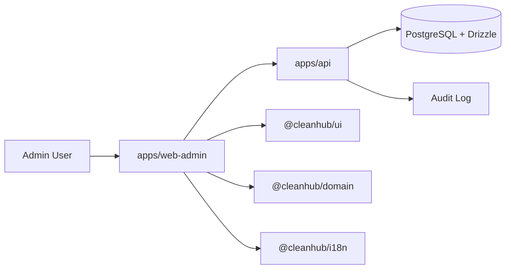
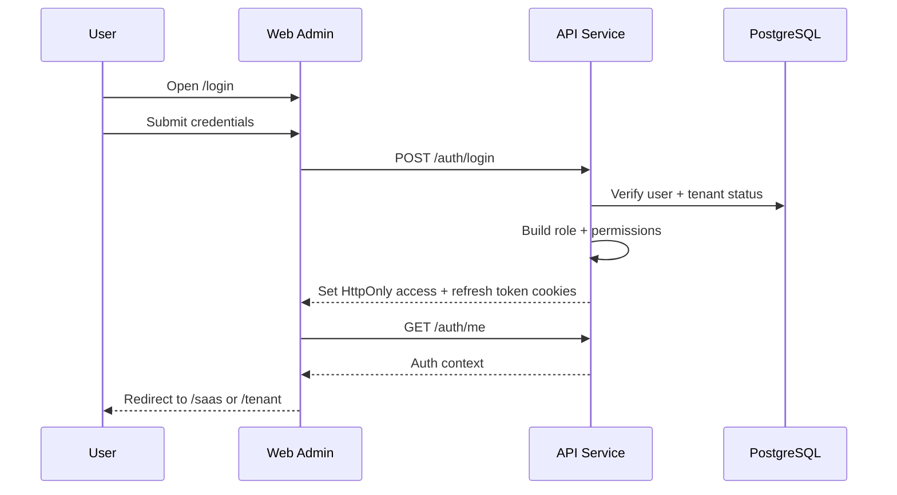
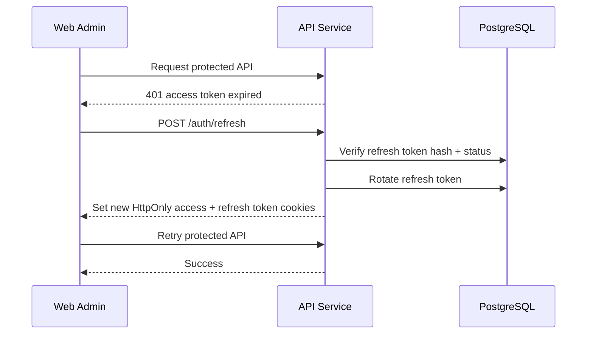
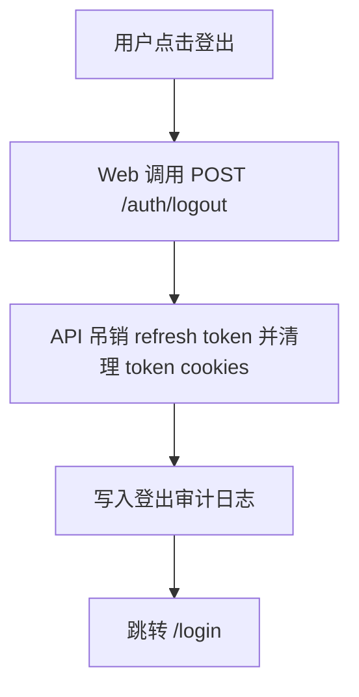
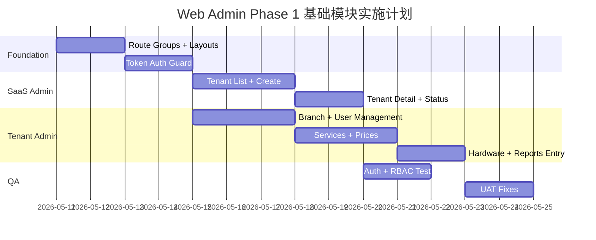

# CleanHub Phase 1 Web Admin 基础模块 TRD v0.1

| 版本 | 日期 | 修改人 | 审阅人 | 状态 | 说明 |
| ---- | ---- | ------ | ------ | ---- | ---- |
| v0.1 | 2026-05-11 | yannqing | yannqing | Draft | Web Admin Phase 1 基础模块技术方案初稿 |
| v0.1.1 | 2026-05-12 | yannqing | yannqing | Draft | 补充 Access Token + Refresh Token + HttpOnly Cookie 认证模型 |

---

## 1. 文档概述

### 1.1 背景

CleanHub Phase 1 需要先完成 Web Admin 的基础管理能力，用于支持平台方创建试点租户、租户方管理门店基础配置、员工账号、服务价格和基础报表。

本 TRD 聚焦 `apps/web-admin` 的第一版技术设计，主要覆盖：

- Web Admin 应用目录结构。
- `(saas)` 平台管理区域。
- `(tenant)` 租户管理区域。
- 认证登录模块。
- RBAC 权限守卫。
- 基础布局、导航、Token 登录态和审计接入。

> **重要边界：支付暂不设计。**  
> Web Admin 中 SaaS 订阅付款、租户支付、B2B 应收、支付配置、Z Report 深度财务规则等内容不在本文档设计范围内，下一个版本单独设计。

### 1.2 技术目标

- 建立 `web-admin` 的 Phase 1 基础架构。
- 明确 `src/app/(saas)` 和 `src/app/(tenant)` 两个核心业务目录边界。
- 明确登录、Token 登录态、租户选择、角色跳转和权限保护方式。
- 为后续租户管理、门店管理、员工管理、服务价格、硬件配置和基础报表提供稳定扩展点。
- 保证后续可平滑接入独立 `apps/api`、Drizzle/PostgreSQL、RLS 和审计日志。

### 1.3 非目标

以下内容不在本 TRD 设计范围内：

- SaaS 订阅支付和租户付款。
- B2B 月结、发票、应收账款。
- Wave / Orange Money / TPE 支付配置。
- POS 收款流程。
- 完整离线同步技术方案。
- 完整硬件驱动集成。
- 完整 UI 高保真设计。

### 1.4 关联文档

| 文档 | 路径 | 说明 |
| ---- | ---- | ---- |
| 产品总 PRD | `docs/01-product/prd/Clean_Hub-prd-v0.1.md` | CleanHub 完整产品范围 |
| Phase 1 范围与验收标准 | `docs/01-product/phase-scope/Clean_Hub-Phase_1范围与验收标准.md` | Phase 1 交付和验收口径 |
| TRD 模板 | `docs/00-overview/templates/TRD模板.md` | 本文档遵循的 TRD 模板 |
| 文档目录说明 | `docs/README.md` | 文档分类规则 |

---

## 2. 范围与约束

### 2.1 In Scope

| 模块 | Phase 1 设计范围 |
| ---- | ---------------- |
| **认证登录** | 登录、退出、Token 刷新、当前用户读取、角色识别、登录后跳转 |
| **SaaS Admin** | 平台概览、租户列表、租户创建、租户详情、租户启停 |
| **Tenant Admin** | 租户概览、门店管理、员工管理、服务价格管理、基础硬件配置、基础报表入口 |
| **权限守卫** | 路由级守卫、角色级守卫、租户级访问边界 |
| **审计接入** | 登录、登出、租户启停、用户禁用、价格修改等敏感操作记录审计事件 |
| **布局与导航** | SaaS 与 Tenant 两套导航和布局 |

### 2.2 Out of Scope

| 模块 | 本版本不设计内容 |
| ---- | ---------------- |
| **支付** | SaaS 订阅付款、租户付款、支付方式配置、退款、Z Report 深度财务 |
| **高级报表** | N vs N-1、多门店对比、高级 BI |
| **营销** | 优惠券、积分、生日营销、沉睡客户召回 |
| **配送** | 预约日历、配送员任务、GPS、ETA |
| **库存 HR** | 库存流水、供应商、排班、打卡、薪资 |
| **AI** | 污渍识别、预测、智能排程 |

### 2.3 技术约束

- `web-admin` 使用 Next.js App Router。
- Phase 1 推荐采用 route group 组织：
  - `src/app/(auth)`
  - `src/app/(saas)`
  - `src/app/(tenant)`
- `web-admin` 不应直接承载所有后端业务逻辑；正式业务 API 应由 `apps/api` 提供。
- 权限校验不能只依赖前端隐藏菜单，API 层必须再次校验。
- 所有业务数据必须具备 `tenant_id`；门店数据必须具备 `branch_id`。
- 敏感操作必须写入审计日志。

---

## 3. Web Admin 应用架构

### 3.1 上下文图



### 3.2 建议目录结构

> 当前 `web-admin` 仍是初始化结构。以下为 Phase 1 目标目录结构。

```text
apps/web-admin/src/
  app/
    (auth)/
      login/
        page.tsx
      layout.tsx
    (saas)/
      layout.tsx
      page.tsx
      tenants/
        page.tsx
        new/
          page.tsx
        [tenantId]/
          page.tsx
          settings/
            page.tsx
      users/
        page.tsx
      audit-logs/
        page.tsx
    (tenant)/
      layout.tsx
      page.tsx
      branches/
        page.tsx
        [branchId]/
          page.tsx
      users/
        page.tsx
      services/
        page.tsx
      prices/
        page.tsx
      hardware/
        page.tsx
      reports/
        page.tsx
    api-health/
      page.tsx
    layout.tsx
    globals.css
  components/
    app-shell/
    auth/
    forms/
    navigation/
    tables/
  features/
    auth/
    saas/
    tenant/
    audit/
  lib/
    api-client.ts
    auth.ts
    auth-context.ts
    permissions.ts
    routes.ts
  types/
    auth.ts
    navigation.ts
```

### 3.3 Route Group 边界

| Route Group | 用途 | 主要角色 |
| ----------- | ---- | -------- |
| `(auth)` | 登录、登出、Token 登录态初始化、忘记密码预留 | 未登录用户、所有管理员 |
| `(saas)` | 平台级管理，管理租户和平台支持能力 | Super Admin / CleanHub Support |
| `(tenant)` | 租户级后台，管理门店、员工、服务、价格、硬件和基础报表 | Owner / Manager |

---

## 4. 认证与登录态设计

### 4.1 登录方式

Phase 1 建议使用统一登录入口：

```text
/login
```

登录表单字段：

| 字段 | 说明 |
| ---- | ---- |
| `identifier` | 邮箱、手机号或用户名 |
| `password` | 密码 |
| `tenant_code` | 可选。租户用户可输入 Pressing Code；平台用户不需要 |

登录后根据用户角色跳转：

| 用户类型 | 跳转目标 |
| -------- | -------- |
| Super Admin | `/saas` |
| CleanHub Support | `/saas` |
| Owner | `/tenant` |
| Manager | `/tenant` |

> **说明：POS PIN 登录不属于 Web Admin Phase 1 登录范围。**  
> POS 高频登录、PIN、锁屏等能力应在 `pos-web` 侧单独设计。

### 4.2 Token 登录态模型

Phase 1 采用 **Access Token + Refresh Token + HttpOnly Cookie** 的认证模型。

> **说明：本文中的登录态不是传统服务端 Session。**  
> Web Admin 不在 `localStorage`、`sessionStorage` 或可被前端 JS 读取的位置保存 token。Token 由 `apps/api` 签发、校验、刷新和吊销，并通过 `HttpOnly Secure Cookie` 承载。

Token 设计建议：

| Token | 用途 | 建议有效期 | 存储位置 | 服务端状态 |
| ----- | ---- | ---------- | -------- | ---------- |
| Access Token | 高频 API 鉴权 | 10-30 分钟 | `HttpOnly Secure Cookie` | 可无状态校验，必要时通过 `jti` 支持黑名单 |
| Refresh Token | 续签 Access Token | 7-30 天，视安全策略调整 | `HttpOnly Secure Cookie` | 需要服务端保存哈希、过期时间、吊销状态和轮换信息 |

Cookie 建议：

| Cookie | 说明 |
| ------ | ---- |
| `cleanhub_access_token` | Access Token，`HttpOnly`、`Secure`、`SameSite=Lax` |
| `cleanhub_refresh_token` | Refresh Token，`HttpOnly`、`Secure`、`SameSite=Lax`，Path 可限制为 `/auth/refresh` 和 `/auth/logout` |

前端只读取脱敏后的 Auth Context，不读取 token 本体。

Auth Context：

```ts
type AdminAuthContext = {
  userId: string;
  tenantId?: string;
  branchIds?: string[];
  role: "super_admin" | "support" | "owner" | "manager";
  permissions: string[];
  accessTokenExpiresAt: string;
};
```

Refresh Token 服务端记录建议：

```ts
type AuthRefreshTokenRecord = {
  id: string;
  userId: string;
  tenantId?: string;
  tokenHash: string;
  familyId: string;
  deviceId?: string;
  userAgent?: string;
  ipAddress?: string;
  expiresAt: string;
  revokedAt?: string;
  replacedByTokenId?: string;
  createdAt: string;
};
```

Refresh Token 需要采用 **轮换机制**：每次刷新成功后，旧 refresh token 作废，签发新的 refresh token。若检测到已作废 refresh token 被再次使用，应视为疑似泄露，吊销同一 `familyId` 下的全部 refresh token，并记录安全审计。

### 4.3 登录流程



### 4.4 Token 刷新流程



### 4.5 登出流程



---

## 5. 权限与路由守卫

### 5.1 权限原则

- 前端路由守卫用于改善用户体验。
- 后端 API 权限校验是最终安全边界。
- SaaS 用户不得访问 Tenant 数据，除非通过明确的支持代操作流程。
- Tenant 用户不得访问其他租户数据。
- Manager 只能访问授权门店范围内的数据。

### 5.2 Route Guard 设计

| 路由 | 允许角色 | 守卫规则 |
| ---- | -------- | -------- |
| `/login` | 未登录用户 | 已登录用户自动跳转到对应首页 |
| `/saas/**` | `super_admin`, `support` | 无平台权限则跳转 403 |
| `/tenant/**` | `owner`, `manager` | 无租户上下文则跳转 403 |

### 5.3 权限点建议

```ts
type Permission =
  | "saas:tenant:read"
  | "saas:tenant:create"
  | "saas:tenant:update"
  | "saas:audit:read"
  | "tenant:branch:read"
  | "tenant:branch:update"
  | "tenant:user:read"
  | "tenant:user:create"
  | "tenant:user:disable"
  | "tenant:service:read"
  | "tenant:service:update"
  | "tenant:hardware:read"
  | "tenant:hardware:update"
  | "tenant:report:read";
```

> **支付权限不在本版本设计。**  
> 例如 `tenant:payment:*`、`tenant:invoice:*`、`saas:billing:*` 暂不纳入 Phase 1 Web Admin 基础模块。

---

## 6. SaaS Admin 设计

### 6.1 功能范围

Phase 1 SaaS Admin 只负责平台方试点管理能力。

| 页面 | 路由 | 说明 |
| ---- | ---- | ---- |
| 平台首页 | `/saas` | 平台基础指标和待处理事项 |
| 租户列表 | `/saas/tenants` | 查看租户列表、搜索、状态筛选 |
| 创建租户 | `/saas/tenants/new` | 创建试点租户 |
| 租户详情 | `/saas/tenants/[tenantId]` | 查看租户基础信息、门店数量、状态 |
| 租户设置 | `/saas/tenants/[tenantId]/settings` | 编辑基础配置、启用/停用租户 |
| 平台用户 | `/saas/users` | 管理平台管理员和支持账号，Phase 1 可简化 |
| 审计日志 | `/saas/audit-logs` | 查看平台级敏感操作日志 |

### 6.2 租户创建字段

| 字段 | 必填 | 说明 |
| ---- | ---- | ---- |
| `name` | 是 | 租户名称 |
| `pressing_code` | 是 | 唯一租户识别码 |
| `country` | 是 | 国家 |
| `city` | 否 | 城市 |
| `default_language` | 是 | 默认语言 |
| `default_currency` | 是 | 默认货币 |
| `contact_name` | 否 | 联系人 |
| `contact_phone` | 否 | 联系电话 |
| `status` | 是 | active / suspended / disabled |

### 6.3 SaaS 操作审计

必须审计：

- 创建租户。
- 修改租户基础信息。
- 启用/停用租户。
- 创建/禁用平台用户。
- 支持人员进入租户视角。

---

## 7. Tenant Admin 设计

### 7.1 功能范围

Phase 1 Tenant Admin 负责试点门店的基础经营配置。

| 页面 | 路由 | 说明 |
| ---- | ---- | ---- |
| 租户首页 | `/tenant` | 基础门店指标、今日订单和待处理事项 |
| 门店管理 | `/tenant/branches` | 查看和编辑门店信息 |
| 门店详情 | `/tenant/branches/[branchId]` | 门店基础信息和营业配置 |
| 员工管理 | `/tenant/users` | 创建、启用、禁用员工 |
| 服务管理 | `/tenant/services` | 服务分类和 Article 管理 |
| 价格管理 | `/tenant/prices` | 标准价格配置 |
| 硬件配置 | `/tenant/hardware` | 打印机、扫码枪、钱箱基础配置 |
| 基础报表 | `/tenant/reports` | 今日营收、订单数、支付方式汇总入口 |

### 7.2 Tenant 操作审计

必须审计：

- 创建/禁用员工。
- 修改门店信息。
- 修改服务项目。
- 修改价格。
- 修改硬件配置。
- 查看或导出敏感报表，若 Phase 1 支持导出。

### 7.3 Tenant 数据边界

- Owner 可以查看租户内全部 Phase 1 数据。
- Manager 默认只能查看授权门店数据。
- 所有查询必须带上 `tenant_id`。
- 门店数据查询必须带上 `branch_id` 或授权门店范围。

---

## 8. 数据设计

### 8.1 Phase 1 Web Admin 相关实体

| 实体 | 用途 |
| ---- | ---- |
| `tenants` | 租户基础信息 |
| `branches` | 门店基础信息 |
| `users` | 平台和租户用户 |
| `roles` | 角色定义 |
| `permissions` | 权限点定义 |
| `user_roles` | 用户角色绑定 |
| `auth_refresh_tokens` | Refresh Token 哈希、轮换、吊销和设备上下文 |
| `auth_login_events` | 登录成功/失败、登出、异常登录等认证审计 |
| `audit_logs` | 审计日志 |
| `services` | 服务项目 |
| `prices` | 标准价格 |
| `hardware_configs` | 基础硬件配置 |

### 8.2 通用字段要求

业务表建议包含：

| 字段 | 说明 |
| ---- | ---- |
| `id` | ULID 主键，数据库类型 `varchar(26)` |
| `tenant_id` | 租户 ID |
| `branch_id` | 门店 ID，适用门店级数据 |
| `created_at` | 创建时间 |
| `updated_at` | 更新时间 |
| `created_by` | 创建人 |
| `updated_by` | 更新人 |
| `deleted_at` | 软删除时间 |
| `deleted_by` | 删除人 |
| `version` | 行版本，用于后续离线/并发控制 |

---

## 9. API 设计

> Phase 1 Web Admin 应优先通过 `apps/api` 提供业务 API。Next.js route handlers 可作为临时 BFF，但不应承载最终业务核心逻辑。

### 9.1 Auth API

| 方法 | 路径 | 说明 |
| ---- | ---- | ---- |
| `POST` | `/auth/login` | 登录 |
| `POST` | `/auth/refresh` | 使用 HttpOnly refresh token 续签 access token，并轮换 refresh token |
| `POST` | `/auth/logout` | 登出 |
| `GET` | `/auth/me` | 获取当前用户 Auth Context |

### 9.2 SaaS API

| 方法 | 路径 | 说明 |
| ---- | ---- | ---- |
| `GET` | `/saas/tenants` | 租户列表 |
| `POST` | `/saas/tenants` | 创建租户 |
| `GET` | `/saas/tenants/:tenantId` | 租户详情 |
| `PATCH` | `/saas/tenants/:tenantId` | 更新租户 |
| `PATCH` | `/saas/tenants/:tenantId/status` | 启用/停用租户 |
| `GET` | `/saas/audit-logs` | 平台审计日志 |

### 9.3 Tenant API

| 方法 | 路径 | 说明 |
| ---- | ---- | ---- |
| `GET` | `/tenant/branches` | 门店列表 |
| `POST` | `/tenant/branches` | 创建门店 |
| `PATCH` | `/tenant/branches/:branchId` | 更新门店 |
| `GET` | `/tenant/users` | 员工列表 |
| `POST` | `/tenant/users` | 创建员工 |
| `PATCH` | `/tenant/users/:userId/status` | 启用/禁用员工 |
| `GET` | `/tenant/services` | 服务列表 |
| `POST` | `/tenant/services` | 创建服务 |
| `PATCH` | `/tenant/services/:serviceId` | 更新服务 |
| `GET` | `/tenant/prices` | 价格列表 |
| `PATCH` | `/tenant/prices/:priceId` | 更新价格 |
| `GET` | `/tenant/hardware-configs` | 硬件配置 |
| `PATCH` | `/tenant/hardware-configs/:configId` | 更新硬件配置 |

### 9.4 暂不设计 API

以下 API 不在本文档设计范围：

- `/payments/**`
- `/billing/**`
- `/invoices/**`
- `/receivables/**`
- `/subscriptions/payments/**`

---

## 10. 前端状态与错误处理

### 10.1 页面状态

所有列表和表单页面至少支持：

- Loading。
- Empty。
- Error。
- Permission Denied。
- Saving。
- Saved。

### 10.2 错误码处理

| 错误类型 | 前端处理 |
| -------- | -------- |
| `401` | 尝试调用 `/auth/refresh`；刷新失败则清理本地 Auth Context 并跳转 `/login` |
| `403` | 展示无权限页面 |
| `404` | 展示资源不存在 |
| `409` | 展示冲突信息，如编码重复 |
| `422` | 展示字段校验错误 |
| `500` | 展示通用错误并记录日志 |

---

## 11. 安全设计

### 11.1 认证安全

- Access Token 与 Refresh Token 均通过 `HttpOnly`、`Secure`、`SameSite=Lax` Cookie 承载。
- Web Admin 不得把 token 存入 `localStorage`、`sessionStorage` 或可被前端 JS 读取的位置。
- Access Token 使用短有效期。
- Refresh Token 必须保存哈希值，不保存明文 token。
- Refresh Token 必须支持轮换、吊销、过期和同一 token family 批量吊销。
- 登出、修改密码、禁用用户、停用租户后，应吊销相关 refresh token。
- 对非 GET 的敏感操作预留 CSRF 防护机制；若未来跨站部署或复杂表单增加，应启用 CSRF token 或双重提交策略。
- 密码不在前端保存。
- 登录失败返回统一错误信息，避免暴露账号是否存在。
- 生产环境必须使用 HTTPS。

### 11.2 权限安全

- 前端菜单基于权限过滤。
- 页面 layout 层执行 route guard。
- API 层执行最终权限校验。
- 所有租户级 API 必须校验 `tenant_id`。

### 11.3 审计安全

审计事件应记录：

| 字段 | 说明 |
| ---- | ---- |
| `actor_user_id` | 操作人 |
| `tenant_id` | 租户 |
| `branch_id` | 门店，若适用 |
| `action` | 操作类型 |
| `entity_type` | 对象类型 |
| `entity_id` | 对象 ID |
| `before` | 修改前摘要 |
| `after` | 修改后摘要 |
| `ip_address` | IP |
| `user_agent` | 浏览器 UA |
| `created_at` | 操作时间 |

---

## 12. 可观测性

Phase 1 Web Admin 至少需要记录：

- 登录成功/失败。
- 登出。
- 403 权限拒绝。
- API 请求失败。
- 租户创建/停用。
- 员工禁用。
- 服务和价格修改。
- 硬件配置修改。

建议后续接入统一日志和错误监控，例如 Sentry 或 OpenTelemetry，但具体工具不在本 TRD 强制范围内。

---

## 13. 测试策略

| 类型 | 测试内容 |
| ---- | -------- |
| 单元测试 | 权限判断、路由配置、表单校验 |
| 集成测试 | 登录、获取 Auth Context、Access Token 过期刷新、Refresh Token 轮换、租户 CRUD、员工禁用 |
| E2E 测试 | Super Admin 登录进入 SaaS；Owner 登录进入 Tenant |
| 权限测试 | Tenant 用户不能访问 `/saas`，SaaS 用户不能越权访问租户数据 |
| 回归测试 | 服务价格修改不影响既有订单，若订单模块接入 |

### 13.1 核心验收用例

| 用例 | 通过标准 |
| ---- | -------- |
| Super Admin 登录 | 成功跳转 `/saas` |
| Owner 登录 | 成功跳转 `/tenant` |
| 未登录访问 `/saas` | 跳转 `/login` |
| Access Token 过期 | 自动调用 `/auth/refresh`，成功后重试原请求 |
| Refresh Token 失效 | 清理 Auth Context，跳转 `/login` |
| Manager 访问 `/saas` | 展示 403 |
| 创建租户 | 租户创建成功，写入审计日志 |
| 禁用员工 | 员工无法继续登录，写入审计日志 |
| 修改价格 | 保存成功，写入审计日志 |

---

## 14. 实施计划



---

## 15. 发布与回滚

### 15.1 发布前检查

- `pnpm --filter @cleanhub/web-admin typecheck`
- `pnpm --filter @cleanhub/web-admin lint`
- `pnpm --filter @cleanhub/web-admin build`
- Auth API 可用。
- SaaS/Tenant 权限测试通过。
- 基础审计写入通过。

### 15.2 回滚策略

- 前端可回滚到上一构建版本。
- API 新增字段需保持向后兼容。
- 权限配置变更需可回滚。
- 若 Auth 变更失败，应保留紧急管理员登录修复方案。

---

## 16. 风险与待确认

| 风险 | 影响 | 建议 |
| ---- | ---- | ---- |
| Auth 方案未最终确认 | 影响前后端接口和权限守卫 | Phase 1 采用统一登录 + Access Token + Refresh Token + HttpOnly Cookie |
| Refresh Token 泄露或重放 | 可能导致账号被持续冒用 | Refresh Token 保存哈希、启用轮换、重放检测和 token family 批量吊销 |
| Cookie CSRF 风险 | 非 GET 请求可能被跨站触发 | Cookie 使用 `SameSite=Lax`，敏感写操作预留 CSRF token 机制 |
| SaaS 和 Tenant 边界混乱 | 可能导致越权访问 | 使用 route group + API RBAC 双重隔离 |
| 支付提前混入设计 | 扩大 Phase 1 范围 | 本版本明确排除支付，后续单独 TRD |
| 审计遗漏 | 难以追责敏感操作 | 将审计作为 API 层强制能力 |
| RLS 暂未实现 | 数据隔离依赖应用层 | 数据模型预留 `tenant_id`，后续升级 RLS |

---

## 17. 技术评审清单

- [ ] `(saas)` 和 `(tenant)` 路由边界清晰。
- [ ] 登录后跳转逻辑清晰。
- [ ] Access Token、Refresh Token、HttpOnly Cookie、刷新和登出吊销流程定义清晰。
- [ ] 未登录、无权限、租户停用等异常状态定义清晰。
- [ ] SaaS 用户和 Tenant 用户权限边界清晰。
- [ ] API 层权限校验原则清晰。
- [ ] 支付相关内容已明确排除。
- [ ] 数据模型预留 `tenant_id`、`branch_id`、审计字段和 `version`。
- [ ] 审计事件列表覆盖 Phase 1 敏感操作。
- [ ] 测试策略覆盖登录、权限、租户和租户后台核心路径。
