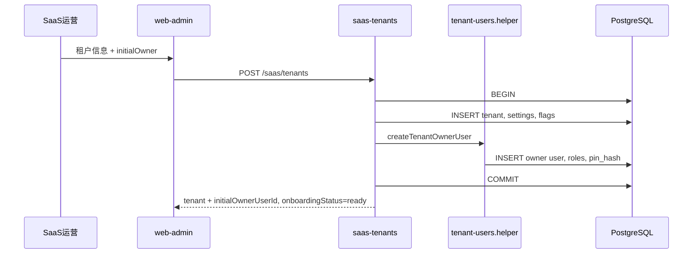
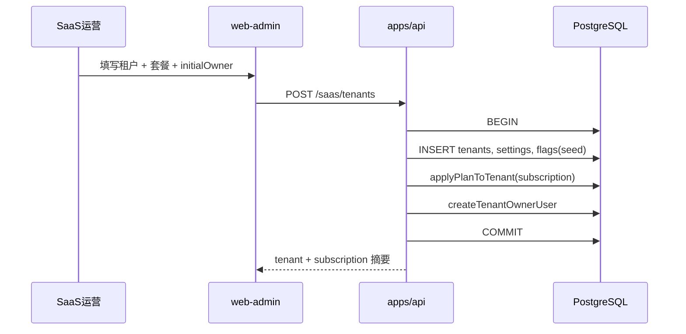
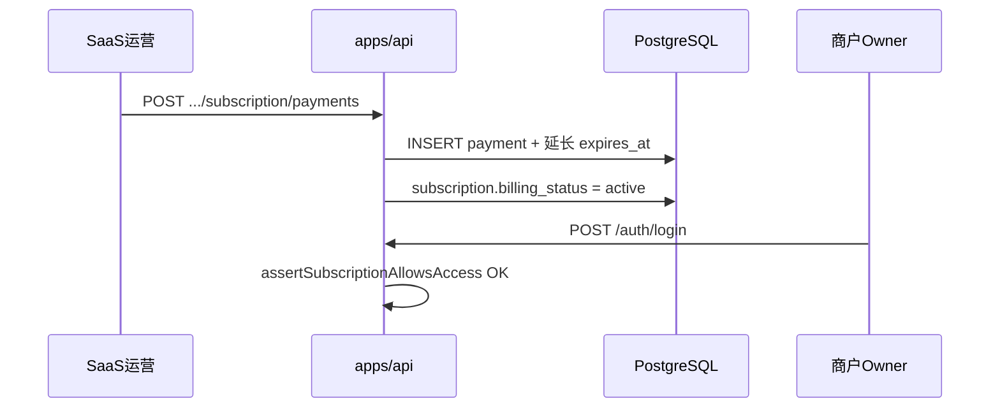

# CleanHub Phase 1.2 补丁 — PDF 对齐：SaaS 租户管理与账号边界 v0.5

| 版本 | 日期 | 状态 | 说明 |
| ---- | ---- | ---- | ---- |
| v0.1 | 2026-06-03 | Draft | 基于 PDF（Changelog）、PRD、Phase 1.1/1.2 TRD 与当前代码的差距分析；定义产品拍板、P0/P1 改造项与文档修订清单 |
| v0.2 | 2026-06-03 | Draft | 员工管理：Phase 1.2 维持 **Owner + Manager** 可 Manage users；PDF §4.9 仅 Owner 标为后续可选对齐 |
| v0.3 | 2026-06-03 | Draft | 新增 **§6.2** 订阅详细开发步骤（数据模型、API、状态机、分期实施） |
| v0.4 | 2026-06-03 | Draft | 补 TOC；Cashier/1.2 范围；开户验收矩阵；P0 负责人与 helper 路径；Owner 双凭证；订阅枚举/错误码/审计；附录 §13–§15 |
| v0.5 | 2026-06-03 | Draft | **§3.6** 冻结全平台 PIN：**恰好 6 位数字**、`users.pin_hash` 单表存储；P0 代码/文档对齐清单 |

**文档正文版本**：v0.5（文件名仍为 `...补丁-v0.1.md`，避免打断已有链接）。

### 目录

- [1. 文档目的](#1-文档目的)
- [2. 参考文档](#2-参考文档)
- [3. 产品拍板](#3-产品拍板冻结口径)（含 [§3.6 PIN](#36-pin-存储与格式全平台冻结)）
- [4. 当前实现快照](#4-当前实现快照截至-2026-06-03-代码复核)
- [5. PDF vs 现状差距矩阵](#5-pdf-vs-现状--saas租户管理差距矩阵)
- [6. 改造方案](#6-改造方案)（[6.1 P0](#61-p0--建议在-phase-12-补丁迭代完成12-周) · [6.2 P1 订阅](#62-p1--订阅模块pdf-38详细开发步骤与逻辑)）
- [7–8. 与 1.1/1.2 关系 · 权限速查](#7-与-phase-11--12-文档关系)
- [9. 验收清单](#9-验收清单p0-补丁)
- [10. PR 切分](#10-建议-pr-切分)
- [11–15. 附录](#11-附录--api-字段草案p0)（P0 字段 · 订阅错误码 · 套餐表 · 迁移 · 审计）
- [16. 修订记录](#16-修订记录)

---

## 1. 文档目的

本文档是 **Phase 1.2 的补充补丁说明**，不替代 `Clean_Hub-Phase_1.2-租户后台功能开发计划-v0.1.md`，用于：

- 固化产品与 PDF 对齐后的 **账号与开户边界**（SaaS / 租户 / 装机）。
- 对照 **当前已实现代码**，列出 SaaS 租户管理（`/saas/tenants*`）及关联链路的 **差距与改法**。
- 标明与 **Phase 1.1、Phase 1.2、Phase 1 验收** 的关系：哪些是补欠项、哪些与 PDF 存在阶段性差异、哪些应单独立项（订阅/试用）。
- 作为开发、测试、装机实施 checklist 的统一依据。

**适用范围**：`apps/api` 的 `saas-tenants`、`tenant-users` helper、`users`（租户员工）、`apps/web-admin` 的 `features/saas/tenants` 与 `features/tenant/users`；**§6.2** 描述 P1 订阅模块设计与实施步骤（实现代码另立 Epic）。**不包含** POS、Desktop、在线支付网关。

---

## 2. 参考文档

| 文档 | 路径 |
| ---- | ---- |
| PDF 技术规格（提取文本） | `docs/04-technical/trd/CleanHub_EN_Changelog.extracted.txt` |
| Phase 1.1 SaaS 平台 | `docs/04-technical/trd/Clean_Hub-Phase_1.1-SaaS平台功能开发计划-v0.1.md` |
| Phase 1.2 租户后台 | `docs/04-technical/trd/Clean_Hub-Phase_1.2-租户后台功能开发计划-v0.1.md` |
| Phase 1 范围与验收 | `docs/01-product/phase-scope/Clean_Hub-Phase_1范围与验收标准.md` |
| PRD v0.1 | `docs/01-product/prd/Clean_Hub-prd-v0.1.md` |

**PDF 关键章节（本补丁引用）**：

- §2.2 / §2.2.1 — Pressing Code、营业时间
- §3.8 — SaaS 管理后台（开户、订阅方案）
- §3.8.1 / §3.8.2 — 手工订阅、试用与双装机模型（**后续 Epic**）
- §4.9 — Manage users（Owner Yes，Manager No）
- §11.3 — 技术员培训（建 tenant、建账号、教 Owner 管员工）

---

## 3. 产品拍板（冻结口径）

以下口径为 **Phase 1.2 补丁周期** 的冻结决策；与 PDF 不一致处见 §3.4。**开户与 SaaS 边界**以本节为准；**员工管理权限**与 Phase 1.2 TRD §8.1 / 现网代码一致。

### 3.1 三类账号（禁止混用）

| 类型 | 登录入口 | 创建方式 | 角色示例 |
| ---- | -------- | -------- | -------- |
| **A. 平台成员** | `/saas` | `POST /saas/users` | `super_admin`、`support` |
| **B. 商户首任管理员** | `/tenant`（须 Pressing Code） | `POST /saas/tenants` 的 `initialOwner`，或 `POST /saas/tenants/:tenantId/owners` | **Owner**（每租户至少 1 个） |
| **C. 商户日常员工** | POS / 部分 `/tenant` | `POST /tenant/users`（**Owner 或 Manager**） | Phase 1.2 web-admin：**`owner`、`manager` 仅**；Cashier 见 §3.5 |

**硬性规则**：

- `POST /saas/users` **仅**创建 `userType=saas`、`tenantId=null` 的平台成员，**不得**用于商户员工。
- SaaS **不**提供「代建 Manager/Cashier」接口；商户员工 **仅**在租户侧 `/tenant/users` 由 **Owner 或 Manager** 管理（与 Phase 1.2 §8.1、现网 API 一致）。

### 3.2 装机交付（D1，推荐）

```text
① 平台 super_admin（或授权账号）在 /saas 创建租户 + initialOwner（Owner）
② 交付：Pressing Code + Owner 邮箱/手机 + 登录密码（web-admin）+ POS PIN（**6 位数字**，见 §3.6）
③ Owner「门店管理员」登录：Pressing Code + 标识符 + 密码 → /tenant
④ Owner（或代操作的 Owner/Manager）在「员工管理」创建 Manager（Phase 1.2 web-admin 可建角色见 §3.5）
⑤ 培训 Owner 后续自行管员工；Cashier 等 POS 角色在后续波次，不在 1.2 web-admin 验收范围
```

**Owner 双凭证（勿混淆）**：

| 凭证 | 用途 | 设定时机 |
| ---- | ---- | -------- |
| **password** | web-admin `/tenant`、API cookie 登录 | SaaS `initialOwner` / `POST .../owners` |
| **pin** | POS / Desktop 收银员身份（与 password 独立） | 同上，必填；入库 `users.pin_hash`；格式见 **§3.6** |

### 3.6 PIN 存储与格式（全平台冻结）

**存储（无单独 PIN 表）**：

- 所有账号（SaaS `userType=saas`、租户 Owner/Manager/员工）共用 **`users`** 表。
- PIN 仅存 **`users.pin_hash`**（`text NOT NULL`），与 `password_hash` 并列；明文 PIN **禁止**落库、禁止写入审计。
- 哈希：`apps/api/src/modules/auth/password.service.ts` 的 **`hashPin`**（与 password 相同 scrypt 参数）。

**格式（产品冻结，2026-06-03）**：

| 项 | 规则 |
| -- | ---- |
| 明文格式 | **恰好 6 位数字**，正则：`/^\d{6}$/` |
| 适用范围 | SaaS `initialOwner.pin`、`POST .../owners` 的 `pin`、`POST /tenant/users` 的 `initialPin`、服务端生成的重置 PIN |
| 与 Phase 1.2 TRD 关系 | 1.2 文档中「4～6 位」表述 **以本补丁为准** 统一为 6 位；同步修订 1.2 §12.3 / §13.4 时注明 |

**现网与目标（代码对齐项，建议纳入 P0 同一 PR 或紧随的小 PR）**：

| 位置 | 现网 | 目标 |
| ---- | ---- | ---- |
| `apps/api/.../saas-tenants/tenants.validation.ts` `initialOwner.pin` | `^\d{4,6}$` | `^\d{6}$` |
| `apps/web-admin/.../tenant-form.validator.ts` Owner PIN | `^\d{4,6}$` | `^\d{6}$` |
| `apps/api/.../users/users.validation.ts` `initialPin` | `^\d{6}$` | 保持 |
| `resetTenantUserPin` 生成逻辑 | 6 位随机 | 保持 |
| `tenant-users.helper` `createTenantOwnerUser` | 无格式校验（依赖上游 Zod） | 上游改为 6 位后一致 |
| Phase 1.2 TRD / 本补丁旧版「4～6」文案 | 混用 | 改为 **6 位** |

**推荐实现（可选）**：在 `packages/domain` 增加 `PIN_DIGIT_PATTERN = /^\d{6}$/` 与 `validatePinDigits(pin: string)`，供 API Zod 与 web-admin 表单共用，避免再次分叉。

**验收**：

- [ ] Owner 开户 PIN `123456` 成功；`12345` / `1234567` 在 API 返回 422。
- [ ] 员工创建 `initialPin` 同样仅接受 6 位。
- [ ] 重置 PIN 返回的临时 PIN 为 6 位数字。

**说明**：PDF §11.3 写明技术员可建 Owner/Manager/Cashier；D1 下技术员 **至少**完成 ①②；④ 在 1.2 以 **Manager** 为主，**不要求** `support` 具备超管没有的 SaaS 建员工 API。

### 3.3 租户侧员工权限（Phase 1.2 交付口径）

| 操作 | Owner | Manager | Cashier（非 1.2 web-admin） |
| ---- | ----- | ------- | ------------------------- |
| Manage users（创建/编辑/禁用员工、重置 PIN） | ✅ | ✅ | ❌（角色未在 1.2 员工 API 开放） |
| 租户设置 `PATCH /tenant/settings` | ✅ | ❌ | ❌ |
| 门店/服务/价格等经营主数据（Phase 1.2 范围） | ✅ | ✅（列表暂不按门店强过滤，见 1.2 §8.2） | ❌ |

**实现**：`POST/PATCH /tenant/users` 的 `roleCode` 为 **`owner` \| `manager` 仅**；写操作 `requireTenantRole(['owner', 'manager'])`；`proxy.ts` 仅放行 `owner`/`manager` 进 `/tenant`。**无需**为 PDF §4.9 在 1.2 做 Owner-only 收紧。

### 3.5 Phase 1.2 角色与终端范围（避免与 PDF 全文混淆）

| 角色 | web-admin `/tenant` | `POST /tenant/users` | 备注 |
| ---- | ------------------- | -------------------- | ---- |
| Owner | ✅ | 可创建（通常不再自建第二个 Owner） | SaaS 开户创建首任 Owner |
| Manager | ✅ | ✅ 可创建/管理 **manager** 等 | 与 §3.3 一致 |
| Cashier | ❌（无 `cashier` JWT 进 tenant 后台） | ❌ 1.2 未实现 | POS 波次；PDF §4.9 表中 Cashier 列供后续对齐 |

**门店数据范围**：员工 `branchIds` 写入 `user_roles.branch_id` / `user_branches`（见 1.2 §8.2、§13.7）；`branch-scope.helper` 读 `user_branches`。1.2 **不按门店过滤**经营列表 API——本补丁 **不**改该决策。

### 3.4 与 PDF §4.9 的差异（记录，非 1.2 阻塞）

| 来源 | Manage users |
| ---- | ------------ |
| PDF §4.9 | Owner ✅，Manager ❌ |
| **Phase 1.2 / 本补丁** | Owner ✅，**Manager ✅** |

**决策（2026-06-03）**：先与 Phase 1.2 TRD、现网代码保持一致；若合同或产品后续要求对齐 PDF，再单独立项收紧 API + 前端（预估小改，见原 v0.1 §6.1.2 思路）。

---

## 4. 当前实现快照（截至 2026-06-03 代码复核）

> 落地 P0/P1 后请更新本节状态列，并在 §16 修订记录注明复核日期。

### 4.1 SaaS 租户 API（`apps/api/src/modules/saas-tenants`）

| 能力 | 状态 | 备注 |
| ---- | ---- | ---- |
| 租户 CRUD（name、pressingCode、country、联系人等） | ✅ | |
| `POST /saas/tenants` + `initialOwner`（同事务） | ✅ | API 层 `initialOwner` **可选**；前端创建页 **必填** |
| `POST /saas/tenants/:tenantId/owners` | ❌ | 1.2 §12.0.2 可选路径未实现 |
| 列表/详情 `hasOwner`、`onboardingStatus` | ❌ | 1.2 §12.0.3 未实现 |
| 订阅方案（Starter/Pro/试用等） | ❌ | 仅有 `tenant_feature_flags` 作能力开关 |
| 创建租户仅 `super_admin` | ✅ | `support` 不可 `POST /saas/tenants` |
| 改租户/settings/flags | ✅ | `super_admin` 或权限码 `saas:tenant:write` |

### 4.2 租户员工 API（`apps/api/src/modules/users`）

| 能力 | 状态 | 与拍板（§3.3） |
| ---- | ---- | -------------- |
| `POST/PATCH /tenant/users`、PIN 重置、禁用 | ✅ | `roleCode`: `owner` \| `manager` only — **与拍板一致** |
| web-admin 员工「新建」入口 | ✅ | Owner、Manager 可见；**无 Cashier 选项** |
| `createTenantOwnerUser` | ✅ | `apps/api/src/modules/tenant-users/tenant-users.helper.ts`（`saas-tenants` 已引用） |
| PIN 明文规则 | ⚠️ 未统一 | Owner 开户 **4～6**；员工 **6**；目标见 **§3.6** 全平台 **6 位** |

### 4.3 认证

| 能力 | 状态 |
| ---- | ---- |
| 租户用户登录须带 Pressing Code（`TENANT_CODE_REQUIRED`） | ✅（API + 登录页分轨） |

### 4.4 数据模型（`packages/db`）

| 表/字段 | 状态 | PDF 相关 |
| ------- | ---- | -------- |
| `tenants.pressing_code` | ✅ | §2.2 |
| `tenant_settings`（语言、币种、timezone、pilotStatus） | ✅ | 无 subscription_plan |
| `tenant_feature_flags` | ✅ | 部分代替洗衣/洗车/零售等 |
| `branches.business_hours` | ✅ | §2.2.1 在 **门店** 级配置，SaaS 开户向导未带 |

---

## 5. PDF vs 现状 — SaaS「租户管理」差距矩阵

| PDF 要求 | 现状 | 补丁优先级 | 处理方向 |
| -------- | ---- | ---------- | -------- |
| 创建商户 + 分配 Pressing Code | ✅ | — | 保持 |
| 开户创建 Owner | ✅（UI 必填） | **P0** | 增加 `onboardingStatus`；可选分步 `POST .../owners` |
| 分配订阅方案 §3.8 | ❌ | **P1** | 新 Epic：`subscription_plan` + 与 flags 策略联动 |
| 试用 / Model A·B §3.8.2 | ❌ | **P1** | 独立表与 SaaS 向导，不塞进当前 tenants PR |
| 手工订阅 / MRR §3.8.1 | ❌ | **P1** | `saas-overview`、订阅看板新模块 |
| 开户时 support 配营业时间 §2.2.1 | ⚠️ | **P0 流程** / P1 产品 | 短期：装机 checklist 要求首店 `branches` 填 hours；中期 SaaS 向导 |
| SaaS 管理商户 Manager/Cashier | ❌（正确） | — | **不要实现** |
| Owner 管员工 §4.9 | ⚠️ 与 PDF 不同；与 1.2/代码一致 | **延后** | 见 §3.4；1.2 **不**做 Owner-only 收紧 |
| 技术员建 tenant §11.3 | ✅ 超管开户 | **P0 文档** | 实施手册写明 D1 |
| support 比 super_admin 多建员工权 | ❌ 无此设计 | — | support 仅 `saas:tenant:write` 等，不开放建 tenant 除非产品另定 |
| PIN 全平台 6 位 | ⚠️ 文档 4～6 vs 代码分叉 | **P0** | 见 **§3.6**；无 schema 变更 |

---

## 6. 改造方案

### 6.1 P0 — 建议在 Phase 1.2 补丁迭代完成（1～2 周）

与 PDF 核心开户、§12.0 欠项、产品拍板一致；**不引入**完整订阅计费。

#### 6.1.1 开户完成态（API + UI）

**产品定义**：

- `onboardingStatus = pending_owner`：存在 `tenants` 记录，但无 active Owner。
- `onboardingStatus = ready`：至少 1 个 active Owner。

**API**：

| 方法 | 路径 | 变更 |
| ---- | ---- | ---- |
| GET | `/saas/tenants` | 列表项增加 `hasOwner: boolean`、`onboardingStatus` |
| GET | `/saas/tenants/:tenantId` | 详情同上；可选 `initialOwnerUserId` 摘要（不含敏感信息） |
| POST | `/saas/tenants/:tenantId/owners` | **新增**；body 同 `initialOwner`；复用 `createTenantOwnerUser`；已有 Owner → `409 OWNER_ALREADY_EXISTS` |

**实现要点**：

- Repository：`EXISTS` 查询 `user_roles` + `roles.code = 'owner'` + `users.status = 'active'` + `users.tenant_id`。
- `createSaasTenant`：验收环境建议 `initialOwner` **必填**（Zod `.optional()` 改为必填，或 `refine` + 明确 422）。
- 权限：`POST .../owners` 与 `POST /saas/tenants` 相同 — 仅 `super_admin`（与现网一致）。
- **唯一实现入口**：`createTenantOwnerUser` 放在 `apps/api/src/modules/tenant-users/tenant-users.helper.ts`；`saas-tenants` 与 `POST .../owners` **必须**调用该 helper，**禁止**在 `users.service` 再复制一套（`users.service` 若仍 re-export，仅作兼容，以 helper 为准）。

**单页 vs 分步开户 — 验收矩阵**（对齐 Phase 1.2 §12.0.1 / §12.0.2）：

| 路径 | API | 前端（建议） | 开户完成判定 |
| ---- | --- | ------------ | ------------ |
| **A. 单页** | `POST /saas/tenants` **含** `initialOwner` | `/saas/tenants/new` 一次提交 | `onboardingStatus = ready` |
| **B. 分步** | ① `POST /saas/tenants` **不含** `initialOwner` → ② `POST .../owners` | 先建租户 → 详情页「添加首任管理员」 | ② 成功后 `ready`；① 后仍为 `pending_owner` |

**产品 / 验收口径（冻结建议）**：

| 层级 | 建议 |
| ---- | ---- |
| **生产 / 正式验收** | 路径 **A** 或 **B** 任选其一端到端；**不得**长期存在 `ready` 以下却对外宣称已装机 |
| **API** | 路径 B 允许 `initialOwner` 省略；路径 A 在 **正式环境** 建议 Zod **必填** `initialOwner`（或 `refine` 返回 422 `INITIAL_OWNER_REQUIRED`） |
| **现网 SaaS 创建页** | 已 **必填** `initialOwner` → 与路径 A 一致；实现 `POST .../owners` 后 **同时**支持路径 B，不强制改创建页为分步 |

**P0 负责人**（与 Phase 1.2 §12.0 一致）：

| 模块 | 负责人 | 说明 |
| ---- | ------ | ---- |
| `createTenantOwnerUser` helper | **杨序** | `tenant-users`；须先于或随 `saas-tenants` 合并 |
| `onboardingStatus`、`POST .../owners`、SaaS UI | **赵付杰** | `saas-tenants`、api-client `saas/tenants*` |
| Schema / 审核 | **李龙杰** | 无新表；PR 审核 |

**P0 开户时序（路径 A）**：



**前端**（`features/saas/tenants`）：

- 列表：筛选/标签「待开通管理员」。
- 详情：`pending_owner` 时展示「添加首任管理员」卡片，提交 `POST .../owners`。
- 保留单页 `/saas/tenants/new`（租户 + initialOwner 一次提交）。

**涉及目录**：

```text
apps/api/src/modules/saas-tenants/**
packages/api-client/src/saas/tenants*
apps/web-admin/src/features/saas/tenants/**
```

#### 6.1.2 租户员工权限（本阶段不改造）

**结论**：维持 Phase 1.2 §8.1 — **Owner 与 Manager** 均可 Manage users；**不纳入** P0 代码变更。

若未来对齐 PDF §4.9（仅 Owner），可参考：

| 层级 | 改法 |
| ---- | ---- |
| API | 写操作 `requireTenantRole(['owner'])`；`list`/`get` 可保留 `owner` + `manager` |
| web-admin | Manager 隐藏「新建员工」、编辑、重置 PIN、禁用 |

#### 6.1.3 装机与营业时间（流程 + 文档）

**不阻塞 P0 代码**，但须在 **装机实施 checklist** 中写明（建议路径：`docs/06-delivery/Clean_Hub-Phase_1.2-D1装机与开户检查清单.md`，**待建**；在文件创建前可将 §6.1.3 本节作为临时 checklist）：

1. 超管完成租户 + Owner（§6.1.1）；交付 §3.2 双凭证。
2. Owner 登录后创建首店（`/tenant/branches`），填写 `businessHours`（对齐 PDF §2.2.1）。
3. Owner 或 Manager 在 `/tenant/users` 创建 **Manager**（及后续 POS 所需的 Cashier，见 §3.5）。
4. 禁止用 `/saas/users` 建商户账号。
5. 确认 `onboardingStatus = ready` 后再对外宣称开户完成。

#### 6.1.4 PIN 与 TRD / 验收文档修订

**PIN（§3.6）** — 与 P0 代码一并落地或紧随 PR：

| 文档 | 修订内容 |
| ---- | -------- |
| 本补丁 | §3.2、§11 等凡写「4～6 位 PIN」改为 **6 位** |
| `Clean_Hub-Phase_1.2-租户后台功能开发计划-v0.1.md` | §12.3、§13.4、员工 UI 文案：PIN **6 位数字**（替换 4～6）；文首引用本补丁 **v0.5** |
| `Clean_Hub-Phase_1范围与验收标准.md` | 员工/Owner 开户 PIN 验收为 **6 位** |

**开户与其它（§6.1.4 原项）**：

| 文档 | 修订内容 |
| ---- | -------- |
| `Clean_Hub-Phase_1.2-租户后台功能开发计划-v0.1.md` | §8.1、§11 **保持** Owner+Manager 可管员工；§12.0 增加「SaaS 不建 Manager/Cashier」；§12.0.3 与本文 §6.1.1 对齐；文首引用本文 §3.4 说明与 PDF 差异 |
| `Clean_Hub-Phase_1范围与验收标准.md` | 场景 12：**保持**「Owner / Manager」可新增员工（与 1.2 一致） |
| PRD 补充（可选） | D1 装机 + 注明 PDF §4.9 与 1.2 员工权限阶段性差异 |

---

### 6.2 P1 — 订阅模块（PDF §3.8）详细开发步骤与逻辑

**定位**：独立 Epic，**勿与** §6.1 开户补丁（`onboardingStatus`、`POST .../owners`）混在同一 PR。  
**现状**：Phase 1.2 用 `tenant_feature_flags` + `tenants.status` 做试点；**不等于** PDF 订阅。  
**工作量粗估**：P1a MVP 约 3～5 人日；P1b 标准约 2～3 周；P1c 完整 PDF 约 1～2 月+。

**PR 依赖**：须 **P0 开户 PR 合并后** 再改 `POST /saas/tenants` 增加 `subscription` 字段（或 P1a 仅用 `PATCH .../subscription` 方案 B，见 §6.2.4，可与 P0 并行但表单联调在后）。

---

#### 6.2.1 概念边界：订阅 vs 租户设置

| 维度 | 租户设置（已有） | 订阅（待建） |
| ---- | ---------------- | ------------ |
| 数据 | `tenant_settings`、`tenant_feature_flags` | `tenant_subscriptions`、`subscription_payments`（P1b） |
| 含义 | 语言、货币、时区、**能力开关**（运营可调） | **商业合同**：套餐档位、账期、试用、收款 |
| UI | `/saas/tenants/[id]/settings` | 建议 **侧栏「订阅管理」** + 租户详情 Tab「订阅与账单」 |
| 谁改 | `super_admin` 或 `saas:tenant:write` | 同上；登记收款需 `super_admin` 或专用权限 |
| PDF | 部分能力由套餐隐含 | §3.8 / §3.8.1 / §3.8.2 |

**联动原则（推荐）**：

1. **开户/改套餐**时：按 `plan_code` **写入默认** `tenant_feature_flags`（策略表驱动）。  
2. **运营 override**：仍允许在「设置」页手工改 flags（与套餐不一致时打审计日志）。  
3. **`requireFeatureEnabled()`**（现网）：继续读 **flags 表**；订阅过期在 **登录层** 另判，不混进 flags 查询。

---

#### 6.2.2 数据模型（`packages/db`）

**表 1：`tenant_subscriptions`**（每租户当前有效订阅一条主记录；历史升级可另表 `subscription_history`，P1b 可选）

| 字段 | 类型 | 说明 |
| ---- | ---- | ---- |
| `id` | ULID PK | |
| `tenant_id` | FK → tenants | 唯一索引（一租户一条 current） |
| `plan_code` | varchar | 档位：**不含**生命周期词；如 `starter`、`pro`、`business`、`enterprise`、`starter_combo`（见 §14） |
| `plan_vertical` | enum | `pressing` \| `car_wash` \| `combo` |
| `billing_status` | enum | 建议列名 `billing_status`（勿与 `plan_code` 混用 `trial`）：`trialing` \| `active` \| `past_due` \| `expired` \| `cancelled` |
| `started_at` | timestamptz | 账期开始 |
| `expires_at` | timestamptz nullable | 到期；trial 必填 |
| `trial_ends_at` | timestamptz nullable | 试用结束（可与 expires 相同） |
| `onboarding_model` | enum nullable | `own_hardware` \| `iwash_hardware`（§3.8.2 Model A/B） |
| `auto_renew` | boolean | 默认 false（Phase 1 手工续费为主） |
| 审计字段 | created/updated + version | 与现网一致 |

**表 2：`subscription_payments`**（P1b，手工收款 §3.8.1）

| 字段 | 类型 | 说明 |
| ---- | ---- | ---- |
| `id` | ULID PK | |
| `tenant_id` | FK | |
| `subscription_id` | FK | 关联续期哪条订阅记录 |
| `amount` | numeric | |
| `currency` | char(3) | XOF / USD / EUR … |
| `paid_at` | timestamptz | |
| `period_start` / `period_end` | timestamptz | 覆盖账期 |
| `method` | enum | `cash` \| `bank_transfer` \| `wave` \| `orange_money` \| `other` |
| `recorded_by` | FK → users | SaaS 操作人 |
| `note` | text nullable | |

**表 3：`subscription_trial_tokens`**（P1c，§3.8.2）

| 字段 | 说明 |
| ---- | ---- |
| `token` | 唯一、不可转移 |
| `tenant_id` | 绑定租户 |
| `expires_at` | 链接失效时间 |
| `consumed_at` | 客户点击激活时间 |

**配置（代码内或表 `plan_feature_policies`）**：套餐 → 默认 flags，**不硬编码在 service 业务里**。

```ts
// 示例：packages/domain 或 apps/api/src/modules/saas-subscriptions/plan-policies.ts
type PlanFeaturePolicy = {
  laundryEnabled: boolean;
  carWashEnabled: boolean;
  retailProductsEnabled: boolean;
  deliveryEnabled: boolean;
  notificationsEnabled: boolean;
  // P1c+：maxBranches?: number 等限额走 middleware
};

const PLAN_POLICIES: Record<string, PlanFeaturePolicy> = {
  "starter:pressing": { laundryEnabled: true, carWashEnabled: false, ... },
  "pro:pressing": { ... },
  // combo 变体单独 key
};
```

**迁移**：`pnpm db:generate` + `pnpm db:migrate`；种子数据可插入 2～3 个试点套餐。

---

#### 6.2.3 状态语义与判定逻辑

**两套「停用」必须分清**：

| 概念 | 字段 | 谁触发 | 效果 |
| ---- | ---- | ------ | ---- |
| 平台运营停用 | `tenants.status` = `suspended` \| `disabled` | super_admin | 强制不可登录，与欠费无关 |
| 订阅过期/欠费 | `tenant_subscriptions.billing_status` = `expired` \| `past_due` | 定时任务或登记收款失败 | 是否拦截登录由产品定（推荐：拦截） |

**订阅是否允许使用（推荐 helper）**：

```text
assertSubscriptionAllowsAccess(tenantId):
  1. 查 tenants.status === 'active'，否则 FORBIDDEN
  2. 查 tenant_subscriptions 当前行：
     - 无记录 → 视产品：允许（兼容旧数据）或 pending_subscription
     - billing_status in (trialing, active) 且 (expires_at is null OR expires_at > now()) → 允许
     - 否则 → `SUBSCRIPTION_EXPIRED`（见 §13）
```

**状态迁移（手工运营为主，P1a）**：

```text
创建租户并选 plan
  → insert tenant_subscriptions { billing_status: active|trialing, started_at: now, expires_at: 按 plan 默认账期 }

登记收款（P1b）
  → insert subscription_payments
  → update expires_at += period
  → subscription.billing_status = active

到期日到达（定时任务 P1b）
  → billing_status = expired
  → 可选：联动 tenants.status = suspended（不推荐自动，避免与运营停用混淆）

试用链接激活（P1c）
  → billing_status = trialing, trial_ends_at = now + 90d, expires_at 同上
```

---

#### 6.2.4 API 设计（`apps/api` 新模块 `saas-subscriptions`）

**路由挂载**（`app.ts`，由负责人注册，勿与 `saas-tenants` 揉在一起）：

```text
/saas/subscriptions/overview          GET    全平台订阅看板（即将到期、试用列表）P1b
/saas/tenants/:tenantId/subscription GET    当前订阅详情 P1a
/saas/tenants/:tenantId/subscription PATCH   改套餐/续期/状态（super_admin 或 saas:tenant:write）P1a
/saas/tenants/:tenantId/subscription/payments GET|POST  收款记录 P1b
/saas/subscription-plans             GET    套餐目录（只读枚举 + 说明）P1a
```

**与创建租户衔接（P1a 二选一）**：

| 方案 | 做法 |
| ---- | ---- |
| **A（推荐）** | 扩展 `POST /saas/tenants` body 增加 `subscription: { planCode, planVertical, expiresAt? }`；`createSaasTenant` 事务内：tenant → settings/flags → **applyPlanToTenant** → initialOwner |
| **B** | 创建租户后单独 `PATCH .../subscription`；多一步 UI，适合分步开户 |

**`applyPlanToTenant` 逻辑（事务内）**：

```text
1. upsert tenant_subscriptions（tenant_id, plan_code, plan_vertical, billing_status, started_at, expires_at）
2. 读 PLAN_POLICIES[plan_code:plan_vertical]
3. merge 写入 tenant_feature_flags（以策略为准；不删除运营已手工改动的字段策略需产品定：推荐「全量覆盖 flags」仅发生在 create/change plan 时）
4. writeAuditLog（见 §15：`eventCategory = saas_subscription`）
```

**改套餐 `PATCH .../subscription`**：

```text
校验 tenant 存在、操作人有 saas:tenant:write 或 super_admin
若仅改 expires_at / status → 更新 subscription 行 + 审计
若改 plan_code → 重新 applyPlanToTenant + 审计（before/after 含 plan 与 flags 摘要）
禁止通过此接口改 pressingCode / Owner
```

**权限**：

| 接口 | 角色/权限 |
| ---- | --------- |
| GET 套餐目录、GET 租户订阅 | `super_admin`, `support` |
| PATCH 订阅、POST 收款 | `super_admin` 或 `hasPermission('saas:tenant:write')` + 后续可加 `saas:subscription:write` |

---

#### 6.2.5 与现网模块集成点

| 集成点 | 文件/模块 | P1a 是否改 | 逻辑 |
| ------ | --------- | ---------- | ---- |
| 登录 | `auth.service.ts` | P1b 建议 | 租户用户 `login` 成功后、`issueToken` 前调用 `assertSubscriptionAllowsAccess(tenantId)`（可配置仅 warn 不拦） |
| 功能开关 API | `permission.helper` `requireFeatureEnabled` | 不改 | 仍读 `tenant_feature_flags` |
| 创建租户 | `saas-tenants.service` `createSaasTenant` | P1a | 同事务写 subscription + apply flags |
| 租户列表 | `saas-tenants` list/detail | P1a 可选 | 列表增加 `planCode`、`billingStatus`、`expiresAt` 摘要 |
| 概览 | `saas-overview` | P1b | `activeSubscriptions`、`expiringIn7Days`、MRR 占位 |
| SaaS 设置页 flags | `tenant-settings-view` | 保留 | 展示「当前套餐：Pro」只读；flags 仍可 override，保存时若与 plan 不一致写审计 |

**POS / Desktop（后续）**：读同一 `tenant_feature_flags`；订阅过期拦截在 **auth** 统一即可。

---

#### 6.2.6 前端（`apps/web-admin`）

**导航（P1a）**：

```text
/saas/subscriptions              # 全平台看板（P1b 丰富）
/saas/tenants/...                # 现有
  详情 Tab：概览 | 设置与能力 | 订阅与账单（新）
```

**创建租户页（P1a）**：在 pressingCode、国家等之下增加：

- 套餐类型：`pressing` / `car_wash` / `combo`
- 套餐档位：Starter / Pro / …（下拉，数据来自 `GET /saas/subscription-plans`）
- 可选：到期日（默认 +1 年或按 plan 默认）
- Model A/B（P1c 再显示「试用」勾选项）

**订阅 Tab（P1a 只读，P1b 可编辑）**：

- 当前 plan、`billingStatus`、`startedAt`、`expiresAt`
- P1b：「登记收款」表单 → `POST .../payments`
- P1b：「续期 / 升级套餐」→ `PATCH .../subscription`

**packages/api-client**：

```text
packages/api-client/src/saas/subscriptions.ts
packages/api-client/src/saas/subscriptions.types.ts
apps/web-admin/src/features/saas/subscriptions/
```

---

#### 6.2.7 分期实施步骤（按 PR 切分）

##### P1a — MVP（约 3～5 人日）

| 步骤 | 后端 | 前端 |
| ---- | ---- | ---- |
| 1 | `packages/db` 增加 `tenant_subscriptions` + migration | — |
| 2 | `plan-policies.ts` + `applyPlanToTenant` helper | — |
| 3 | `saas-subscriptions` 模块：GET plans、GET/PATCH tenant subscription | — |
| 4 | 扩展 `createSaasTenant` 接收 `subscription` 并同事务 apply | 创建租户表单加套餐选择 |
| 5 | `packages/api-client` | 对接 actions/queries |
| 6 | 租户详情「订阅」Tab 只读展示 | Tab UI |
| 7 | 类型检查 + 种子租户走一单 E2E | 手工验证 flags 随 plan 变化 |

**P1a 验收**：新建租户选 Starter+pressing → flags 中 laundry=true、carWash=false；PATCH 改 Pro → flags 按 Pro 策略更新；审计有 `subscription.plan_assigned`。

##### P1b — 标准运营（约 2～3 周）

| 步骤 | 内容 |
| ---- | ---- |
| 1 | `subscription_payments` 表 + CRUD API |
| 2 | `GET /saas/subscriptions/overview`（即将到期 7/30 天） |
| 3 | `assertSubscriptionAllowsAccess` 接入 `auth.service` login |
| 4 | 定时任务或管理端按钮：批量标记 expired（`expires_at < now`） |
| 5 | `/saas/subscriptions` 列表页（颜色：绿/橙/红） |
| 6 | `saas-overview` 增加订阅统计字段 |
| 7 | 文档：过期后是否自动 `tenants.status=suspended`（推荐 **不自动**，仅订阅层拦截） |

##### P1c — 完整 PDF（约 1～2 月+）

| 步骤 | PDF 章节 |
| ---- | -------- |
| 1 | 试用 token 生成、公开激活路由、试用看板 |
| 2 | Model A/B 开户向导字段 |
| 3 | 多币种、PDF 收据、WhatsApp/邮件 提醒（对接通知模块） |
| 4 | Plan limits middleware（门店数、报表导出等） |
| 5 | MRR / 收款报表 |

---

#### 6.2.8 流程图（开户 + 续费）

**开户（P1a，方案 A）**：



**手工续费（P1b）**：



---

#### 6.2.9 订阅模块验收清单（P1）

**P1a**

- [ ] 创建租户必选 `planCode` + `planVertical`；`tenant_feature_flags` 与套餐策略一致。
- [ ] 租户详情可查看当前订阅（plan、`billingStatus`、`expiresAt`）。
- [ ] `PATCH` 升级套餐后 flags 更新且写审计。
- [ ] 订阅与「设置」页功能开关职责分离（文档与 UI 文案清晰）。

**P1b**

- [ ] 可登记手工收款并延长 `expires_at`。
- [ ] 订阅过期后租户用户登录被拒绝（或明确提示页）。
- [ ] `/saas/subscriptions` 可看即将到期列表。

**P1c**

- [ ] 试用链接仅能激活一次、绑定 tenant。
- [ ] Model A/B 在订阅表可追溯。

---

#### 6.2.10 文件所有权与依赖（建议）

| 负责人建议 | 范围 |
| ---------- | ---- |
| 后端 A | `packages/db` schema、`apps/api/src/modules/saas-subscriptions/**` |
| 后端 B（或同一人） | 扩展 `saas-tenants` create、`auth` 订阅校验 |
| 前端 | `features/saas/subscriptions/**`、租户创建页/详情 Tab |
| api-client | `packages/api-client/src/saas/subscriptions*` |
| 李龙杰 | schema 审核、审计 eventCategory 登记 |

**依赖顺序**：db migration → plan policies helper → subscription API → api-client → 扩展 create tenant → web-admin。

**独立 TRD**：立项时可复制本节为 `Clean_Hub-Phase_1.x-订阅与试用-v0.1.md`，本文 §6.2 保持摘要+步骤权威副本。

---

#### 6.2.11 风险与产品待定项（开发前需确认）

| # | 问题 | 建议默认 |
| - | ---- | -------- |
| 1 | 改 plan 是否 **强制覆盖** 全部 feature_flags？ | 是（仅 change plan 时） |
| 2 | 无 subscription 行的历史租户？ | 登录不拦；列表显示「未配置套餐」；P1a 上线脚本见 §14.3 |
| 3 | 过期是否自动改 `tenants.status`？ | 否，仅 auth 层拦 |
| 4 | Owner 能否在 `/tenant` 看订阅？ | P1 仅 SaaS 可见；商户侧账单页可 Phase 2 |
| 5 | 在线支付 Wave/Orange？ | P2+，不阻塞 P1a/P1b |

---

### 6.3 P2 — 更晚

- 平台仅 support 可做的服务器时间/时区纠错（PDF §2.3）。
- 工单后台、TeamViewer、自修复（§3.8.0x）— 已有独立模块规划，不在本文展开。

---

## 7. 与 Phase 1.1 / 1.2 文档关系

| 关系 | 说明 |
| ---- | ---- |
| **vs Phase 1.1** | P0 为 **扩展**（`initialOwner`、`onboardingStatus`），**不推翻** 1.1 租户 CRUD。1.1「仅 super_admin 创建租户」与 PDF「support 配设置」**不冲突**：support 用 `saas:tenant:write` 改 settings/flags；装机开户仍建议 super_admin。 |
| **vs Phase 1.2** | P0 主要为 **补 §12.0 开户欠项**（`onboardingStatus`、`POST .../owners`）；**员工权限与 1.2 §8.1 一致**，不做收紧。 |
| **vs Phase 1.3** | Manager 仍可参与员工 CRUD；1.3 强化的是 **branchIds 落库与数据范围过滤**，非取消 Manager 建人。 |

**冲突处理原则**：**开户 / SaaS 边界**以本文 §3.1–§3.2 为准；**员工 Manage users** 以 Phase 1.2 + §3.3 为准；PDF §4.9 差异见 §3.4，后续产品决策再改。

---

## 8. 权限速查（避免「技术支持」误解）

| 角色 | 创建租户+Owner | 改租户/开关 | 建平台成员 | 建商户员工 |
| ---- | -------------- | ----------- | ---------- | ---------- |
| `super_admin` | ✅ | ✅ | ✅ | ❌（须商户侧 Owner/Manager 调 `/tenant/users`） |
| `support` | ❌（现网） | ✅ 若有 `saas:tenant:write` | ❌ | ❌ |
| 现场技术员 | 使用超管账号或运营代开户 | — | — | ❌；代 Owner/Manager 登录 `/tenant` 后建人 |
| 商户 Owner | ❌ | ❌（租户设置另模块） | ❌ | ✅ |
| 商户 Manager | ❌ | ❌ | ❌ | ✅（与 Owner 相同，§3.3） |

**support 没有「超管没有的建员工特权」**；PDF 中的 CleanHub support 多指 **运营/客服能力**（工单、远程、改租户配置），不是 SaaS 角色 `support` 的额外 API。

---

## 9. 验收清单（P0 补丁）

### 9.1 SaaS 开户

- [ ] `POST /saas/tenants` 带 `initialOwner` 后，Owner 可用 Pressing Code 登录 `/tenant`。
- [ ] 列表/详情对无 Owner 租户显示 `pending_owner`（或等价文案）。
- [ ] `POST /saas/tenants/:tenantId/owners`：无 Owner 时可创建；已有 Owner 返回 409。
- [ ] `POST /saas/users` 无法创建 `tenantId` 非空的商户用户（保持 1.1 行为）。

### 9.2 租户员工（Phase 1.2 口径）

- [ ] **Owner** 可创建/编辑/禁用员工、重置 PIN。
- [ ] **Manager** 可创建/编辑/禁用员工、重置 PIN（与现网一致）。
- [ ] web-admin：Owner、Manager 均可见员工管理写入口；员工角色下拉 **无 Cashier**（§3.5）。
- [ ] 路径 B：`POST /saas/tenants` 无 Owner → `pending_owner` → `POST .../owners` → `ready`。

### 9.3 装机（D1）

- [ ] 实施文档：超管开户 → 交 Owner 凭证 → Owner/Manager 建员工 → 首店营业时间。
- [ ] 登录页：门店管理员须填 Pressing Code。
- [ ] Owner/员工 PIN 均为 **6 位数字**（§3.6）。

### 9.4 文档

- [ ] Phase 1.2 §12.0 开户相关与 §6.1.4 对齐；§8.1 员工权限保持 Owner+Manager。
- [ ] Phase 1 验收场景 12 保持 Owner/Manager 新增员工。

---

## 10. 建议 PR 切分

| PR | 范围 | 负责人 | 依赖 |
| -- | ---- | ------ | ---- |
| **PR-0**（若未合并） | `tenant-users.helper` 中 `createTenantOwnerUser` | **杨序** | 李龙杰审核；阻塞 PR-1 |
| **PR-1** | `onboardingStatus`、`POST .../owners`、api-client `saas/tenants*`、SaaS 列表/详情/分步 UI；**PIN 统一 6 位**（§3.6） | **赵付杰** | PR-0；李龙杰审核 |
| **PR-2** | 文档：1.2 §12.0.3、`docs/06-delivery/...D1装机...`（§6.1.3）、Phase 1 验收场景 12 脚注 | 产品/技术写作 | 可与 PR-1 并行 |
| **PR-3**（P1a，另 Epic） | `tenant_subscriptions` + `saas-subscriptions` + 创建租户选套餐 | 订阅负责人 | **PR-1 合并后**（或仅用 PATCH 订阅） |

**不纳入 P0**：`tenant/users` Owner-only 收紧（已取消，见 §3.3、§6.1.2）。

**合并前联调**：无 Owner → `pending_owner`；路径 A/B 各一单；Owner/Manager 员工 CRUD 回归；Owner 用 password 登录 `/tenant`（非 PIN）。

---

## 11. 附录 — API 字段草案（P0）

```ts
// 列表/详情扩展
type SaasTenantOnboardingStatus = "pending_owner" | "ready";

type SaasTenantListItem = {
  // ...existing
  hasOwner: boolean;
  onboardingStatus: SaasTenantOnboardingStatus;
};

// POST /saas/tenants/:tenantId/owners
type CreateSaasTenantOwnerRequest = {
  displayName: string;
  email: string;
  phone?: string;
  password: string;
  pin: string; // exactly 6 digits, see §3.6
};

type CreateSaasTenantOwnerResponse = {
  tenantId: string;
  initialOwnerUserId: string;
};
```

错误码（与现网 helper 一致）：

| code | HTTP | 场景 |
| ---- | ---- | ---- |
| `OWNER_ALREADY_EXISTS` | 409 | 租户已有 Owner |
| `SAAS_TENANT_NOT_FOUND` | 404 | 租户不存在 |
| `TENANT_USER_EMAIL_CONFLICT` | 409 | 邮箱在租户内重复 |
| `INITIAL_OWNER_REQUIRED` | 422 | （可选）正式环境强制单页开户带 `initialOwner` |

---

## 12. 附录 — 订阅与认证错误码（P1）

在 `auth.errors.ts` / `error-handler.ts` 中登记（P1b 登录拦截时启用）：

| code | HTTP | 场景 |
| ---- | ---- | ---- |
| `SUBSCRIPTION_EXPIRED` | 403 | 租户订阅已过期或 `billing_status` 不允许使用 |
| `SUBSCRIPTION_NOT_CONFIGURED` | 403 | （可选）强制要求有订阅行时 |

与 `tenants.status !== active`、`FEATURE_DISABLED` 区分：前者为平台停用，后者为能力开关，本项为 **账期**。

---

## 13. 附录 — 套餐目录初版（P1a，`GET /saas/subscription-plans`）

策略键：`${plan_code}:${plan_vertical}`。下表为 **MVP 建议**，产品可增删；实现放在 `plan-policies.ts` 或 `packages/domain`。

| plan_code | plan_vertical | 显示名 | 默认 billing_status | 默认账期 | laundry | carWash | retail | delivery | notifications |
| --------- | ------------- | ------ | -------------------- | -------- | ------- | ------- | ------ | -------- | ------------- |
| starter | pressing | Starter 洗衣 | active | 12 月 | ✅ | ❌ | ❌ | ❌ | ❌ |
| pro | pressing | Pro 洗衣 | active | 12 月 | ✅ | ❌ | ✅ | ✅ | ✅ |
| starter | car_wash | Starter 洗车 | active | 12 月 | ❌ | ✅ | ❌ | ❌ | ❌ |
| pro | combo | Pro 综合 | active | 12 月 | ✅ | ✅ | ✅ | ❌ | ✅ |

**试用（P1c）**：`plan_code` 仍为档位名；`billing_status = trialing`，`trial_ends_at` / `expires_at` 由运营或试用链接写入，**不要**使用 `plan_code = trial`。

---

## 14. 附录 — 历史租户与数据迁移（P1a）

### 14.1 无 `tenant_subscriptions` 行的租户

| 策略 | 行为 |
| ---- | ---- |
| **默认（§6.2.11 #2）** | 登录 **不拦截**；SaaS 列表展示「未配置套餐」 |
| 可选收紧 | 新开户必选套餐后，仅对 **新租户** 强制；老租户分批补录 |

### 14.2 P1a 上线一次性任务（建议）

1. 导出所有 `tenants.id` 无 subscription 行者。
2. 运营确认每户 `plan_code` + `plan_vertical`（或暂设 `starter:pressing`）。
3. 脚本或管理端批量 `PATCH .../subscription` 调用 `applyPlanToTenant`（**会按策略覆盖 flags**，须提前通知）。
4. 审计抽样：`eventCategory = saas_subscription`，`eventType = subscription.plan_assigned`。

### 14.3 与 P0 顺序

- **先** P0 开户字段稳定，**再** P1a migration，避免同一 PR 改 `createSaasTenant` 两处逻辑难以回滚。

---

## 15. 附录 — 审计 eventCategory（订阅）

在 Phase 1.2 TRD **§16.2** 租户 `tenant_*` 命名表之外，SaaS 侧订阅建议：

| eventCategory | eventType 示例 | 说明 |
| ------------- | -------------- | ---- |
| `saas_subscription` | `subscription.plan_assigned` | 开户或改套餐 |
| `saas_subscription` | `subscription.renewed` | 登记收款续期（P1b） |
| `saas_subscription` | `subscription.expired` | 批量过期标记（P1b） |
| `saas_tenant` | `tenant.feature_flags.override` | （可选）设置页手工改 flags 与套餐不一致 |

登记前由 **李龙杰** 并入 §16.2 或 SaaS 审计筛选文档。

---

## 16. 修订记录

| 版本 | 日期 | 作者 | 说明 |
| ---- | ---- | ---- | ---- |
| v0.1 | 2026-06-03 | — | 初稿：PDF 对齐、P0/P1 分工、与 1.1/1.2 关系、验收与 PR 切分 |
| v0.2 | 2026-06-03 | — | 员工管理：维持 Owner+Manager；§3.4 PDF 差异 |
| v0.3 | 2026-06-03 | — | §6.2 订阅详细开发步骤 |
| v0.4 | 2026-06-03 | — | TOC；§3.5 Cashier/1.2 范围；开户矩阵与 P0 时序；双凭证；`billing_status` 命名；§12–§15 附录；PR 负责人 |
| v0.5 | 2026-06-03 | — | **§3.6** 全平台 PIN 6 位 + `users.pin_hash`；P0 对齐清单与验收 |

---

**维护说明**：P0 落地后，在 `Clean_Hub-Phase_1.2-租户后台功能开发计划-v0.1.md` 文首引用本文 **v0.5** 及 §3.4、§3.6、§6.1。订阅实施以 **§6.2** 为准；可另立 `Clean_Hub-Phase_1.x-订阅与试用-v0.1.md`（复制 §6.2 + §12–§15），勿与 §6.1 开户补丁混版本。代码变更后请复核 **§4** 快照。
